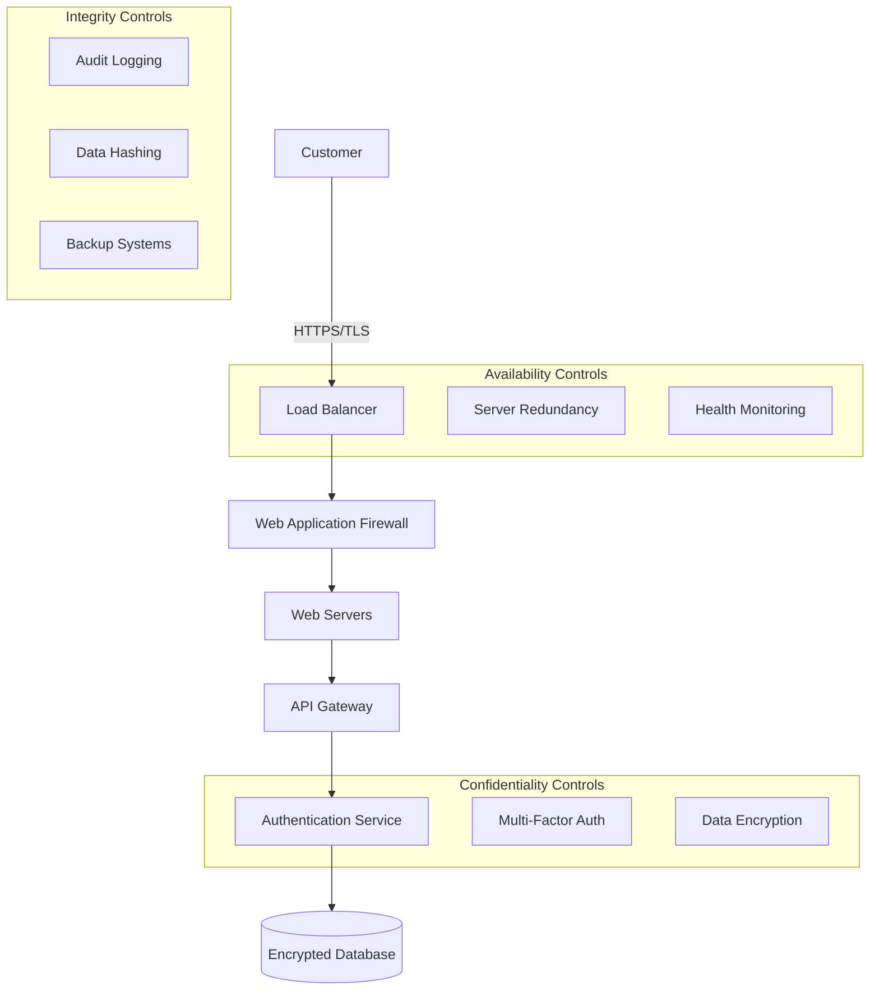

# CIA Triad Explained: The Foundation of Cybersecurity (with Real Case Studies)

Ever wondered what makes data truly secure? Or why some companies can withstand cyber attacks while others crumble? The answer lies in understanding the **CIA Triad**—the foundational model of information security that every developer, sysadmin, and business owner should master.

The CIA Triad represents three pillars supporting information security. Remove one pillar, and the whole structure becomes vulnerable.

---

## What is the CIA Triad?

The **CIA Triad** is a foundational model in cybersecurity that defines three core principles for securing information:

- **Confidentiality** → ensuring data stays private
- **Integrity** → maintaining data accuracy and trustworthiness
- **Availability** → keeping systems accessible when needed

In simple terms:

- **Confidentiality**: "Only the right people can see this"
- **Integrity**: "The data hasn't been tampered with"
- **Availability**: "The system works when I need it"

It's like having a secure vault (confidentiality), with tamper-proof locks (integrity), that opens when you need it (availability).

**Sources:** [NIST Cybersecurity Framework](https://www.nist.gov/cyberframework), [CISA Best Practices](https://www.cisa.gov/topics/cybersecurity-best-practices)

---

## Why the CIA Triad Matters

The CIA Triad serves as a **benchmark for data security** in any computerized business environment. Here's why each element is crucial:

- **Business Impact** → violations can cost millions and destroy reputation
- **Compliance Requirements** → regulations like GDPR mandate CIA principles
- **Risk Management** → helps identify and mitigate security vulnerabilities
- **Security Architecture** → guides implementation of security controls

Example real-world impact:

- **For banks**: Customer data breaches can lead to regulatory fines and lost trust
- **For hospitals**: Patient data must remain confidential yet available for emergencies
- **For e-commerce**: Transaction integrity ensures customers aren't overcharged

---

## Confidentiality (Kerahasiaan)

**Definition**: Ensuring that sensitive information is accessible only to authorized individuals.

### Key Principles:

- **Access Control** → who can see what data
- **Data Classification** → categorizing information by sensitivity level
- **Encryption** → scrambling data so unauthorized users can't read it
- **Authentication** → verifying user identity before granting access

### Implementation Methods:

#### Access Control Examples

```
Data Classification Levels:
┌─────────────────────────────────────┐
│ PUBLIC     → Marketing materials    │
│ INTERNAL   → Employee directories   │
│ RESTRICTED → Financial reports      │
│ SECRET     → Trade secrets         │
└─────────────────────────────────────┘
```

#### Common Confidentiality Controls:

1. **Role-Based Access Control (RBAC)**

   ```
   Employee Role → Permitted Data Access
   ────────────────────────────────────
   Intern        → Public documents only
   Staff         → Internal + Public
   Manager       → Restricted + Internal + Public
   Executive     → All data levels
   ```

2. **Encryption at Rest and Transit**

   - Data stored encrypted on servers
   - HTTPS for web traffic
   - VPN for remote access

3. **Multi-Factor Authentication (MFA)**
   - Something you know (password)
   - Something you have (phone/token)
   - Something you are (biometrics)

---

## Integrity (Integritas)

**Definition**: Ensuring data accuracy, consistency, and trustworthiness throughout its lifecycle.

### Key Principles:

- **Data Accuracy** → information reflects reality
- **Completeness** → no unauthorized additions or deletions
- **Consistency** → data remains uniform across systems
- **Non-repudiation** → actions can be traced back to users

### Implementation Methods:

#### Integrity Protection Techniques

```
Integrity Controls:
┌─────────────────────────────────────────┐
│ HASHING      → Detect data changes     │
│ CHECKSUMS    → Verify file integrity   │
│ DIGITAL SIGS → Prove data authenticity │
│ AUDIT LOGS   → Track all changes       │
└─────────────────────────────────────────┘
```

#### Common Integrity Controls:

1. **Database Constraints**

   ```sql
   -- Ensure data meets business rules
   ALTER TABLE users ADD CONSTRAINT
   CHECK (age >= 0 AND age <= 150);

   -- Prevent duplicate entries
   CREATE UNIQUE INDEX idx_email ON users(email);
   ```

2. **Version Control Systems**

   - Git for code integrity
   - Track who changed what and when
   - Ability to rollback unauthorized changes

3. **Backup and Recovery**
   - Regular automated backups
   - Point-in-time recovery capabilities
   - Backup integrity verification

---

## Availability (Ketersediaan)

**Definition**: Ensuring systems and data are accessible to authorized users when needed.

### Key Principles:

- **System Uptime** → minimizing downtime
- **Performance** → systems respond quickly
- **Scalability** → handling increased load
- **Disaster Recovery** → quick restoration after incidents

### Implementation Methods:

#### Availability Architecture

```
High Availability Setup:
┌─────────────────────────────────────────┐
│ LOAD BALANCER                           │
│           ↓                             │
│ ┌─────────┐  ┌─────────┐  ┌─────────┐  │
│ │ Server 1│  │ Server 2│  │ Server 3│  │
│ └─────────┘  └─────────┘  └─────────┘  │
│           ↓                             │
│ ┌─────────────────────────────────────┐ │
│ │ Primary DB    →    Backup DB        │ │
│ └─────────────────────────────────────┘ │
└─────────────────────────────────────────┘
```

#### Common Availability Controls:

1. **Redundancy and Failover**

   - Multiple servers handling requests
   - Automatic switching to backup systems
   - Geographic distribution of resources

2. **Performance Monitoring**

   ```bash
   # Example monitoring metrics
   CPU Usage: <70%
   Memory Usage: <80%
   Response Time: <200ms
   Uptime: >99.9%
   ```

3. **DDoS Protection**
   - Rate limiting requests
   - Traffic filtering
   - CDN services for load distribution

---

## Real-World Case Study: BSI Ransomware Attack (2023)

Analyzing a real cybersecurity incident using the CIA Triad framework:

### Case Background: Bank Syariah Indonesia (BSI) Ransomware

In May 2023, BSI (Bank Syariah Indonesia) suffered a major ransomware attack by the LockBit 3.0 group, affecting millions of customers.

### CIA Triad Analysis

| **CIA Component** | **Status** | **Analysis** |
|------------------|------------|--------------||
| **Confidentiality** | **VIOLATED** | 1.5TB of sensitive data stolen including ~15 million customer records (names, phone numbers, addresses, account balances, transaction history). Hackers published proof of data theft, clearly violating customer data confidentiality. |
| **Integrity** | **MAINTAINED** | No evidence of data manipulation or falsification. Ransomware typically encrypts rather than corrupts data. BSI confirmed all transaction records remained accurate and unaltered. |
| **Availability** | **VIOLATED** | Mobile banking and ATM services were offline for several days. Customers couldn't perform transactions, causing significant business disruption and customer inconvenience. |

### Impact Assessment

#### Customer Impact:

- **Financial Disruption**: Inability to transfer money or pay bills
- **Privacy Breach**: Personal and financial data exposed
- **Trust Erosion**: Reduced confidence in BSI's security

#### Business Impact:

- **Operational Losses**: Services down for multiple days
- **Reputational Damage**: Public exposure of security weaknesses
- **Regulatory Scrutiny**: Potential compliance violations

#### Financial Impact:

- **Direct Costs**: System recovery and incident response
- **Indirect Costs**: Customer compensation and lost business
- **Compliance Fines**: Potential regulatory penalties

---

## CIA Triad Best Practices

### Strengthening Confidentiality

```bash
# Example: Implement strong access controls
┌─────────────────────────────────────┐
│ 1. Multi-Factor Authentication      │
│    └─ Password + SMS/App + Biometric│
│                                     │
│ 2. Principle of Least Privilege     │
│    └─ Users get minimum access needed│
│                                     │
│ 3. Regular Access Reviews           │
│    └─ Audit and remove unused access│
│                                     │
│ 4. Data Encryption                  │
│    └─ AES-256 for data at rest     │
│    └─ TLS 1.3 for data in transit  │
└─────────────────────────────────────┘
```

### Maintaining Integrity

```bash
# Example: Data integrity controls
┌─────────────────────────────────────┐
│ 1. Digital Signatures              │
│    └─ Verify data source/authenticity│
│                                     │
│ 2. Hash Functions                   │
│    └─ SHA-256 for change detection │
│                                     │
│ 3. Audit Logging                   │
│    └─ Track all data modifications │
│                                     │
│ 4. Input Validation                │
│    └─ Sanitize all user inputs     │
└─────────────────────────────────────┘
```

### Ensuring Availability

```bash
# Example: High availability setup
┌─────────────────────────────────────┐
│ 1. Redundant Systems               │
│    └─ N+1 server configuration     │
│                                     │
│ 2. Automated Backups              │
│    └─ 3-2-1 backup strategy       │
│                                     │
│ 3. Disaster Recovery Plan         │
│    └─ RTO: 4 hours, RPO: 1 hour   │
│                                     │
│ 4. Performance Monitoring         │
│    └─ Real-time alerting system   │
└─────────────────────────────────────┘
```

---

## Advanced CIA Implementation

### Balancing the CIA Triad

Sometimes CIA components can conflict. Here's how to balance them:

#### Security vs. Usability Trade-offs

```
High Security ←────────────→ High Usability
      ↓                            ↓
┌─────────────┐              ┌─────────────┐
│ - Multiple  │              │ - Single    │
│   passwords │              │   sign-on   │
│ - Complex   │              │ - Simple    │
│   procedures│              │   interfaces│
│ - Limited   │              │ - Open      │
│   access    │              │   access    │
└─────────────┘              └─────────────┘
```

#### Designing for CIA

**Example: Banking System Architecture**



---

## Common CIA Violations and How to Prevent Them

### Confidentiality Breaches

| **Threat**             | **Example**                           | **Prevention**               |
| ---------------------- | ------------------------------------- | ---------------------------- |
| **Data Leaks**         | Unencrypted databases exposed         | Implement encryption at rest |
| **Insider Threats**    | Employees accessing unauthorized data | Role-based access controls   |
| **Social Engineering** | Phishing attacks stealing credentials | Security awareness training  |

### Integrity Violations

| **Threat**               | **Example**                           | **Prevention**                   |
| ------------------------ | ------------------------------------- | -------------------------------- |
| **Data Tampering**       | Attackers modifying financial records | Digital signatures and checksums |
| **Unauthorized Changes** | Accidental data corruption            | Change management processes      |
| **Man-in-the-Middle**    | Traffic interception and modification | End-to-end encryption            |

### Availability Disruptions

| **Threat**            | **Example**                        | **Prevention**                     |
| --------------------- | ---------------------------------- | ---------------------------------- |
| **DDoS Attacks**      | Overwhelming servers with requests | Load balancers and rate limiting   |
| **Ransomware**        | Encrypting critical systems        | Offline backups and recovery plans |
| **Hardware Failures** | Server crashes causing downtime    | Redundant systems and failover     |

---

## Tools for Implementing CIA

### Confidentiality Tools

- **Encryption**: OpenSSL, BitLocker, VeraCrypt
- **Access Management**: Active Directory, Okta, Auth0
- **VPN**: WireGuard, OpenVPN, Cisco AnyConnect

### Integrity Tools

- **Hash Functions**: SHA-256, MD5 (deprecated), BLAKE2
- **Digital Signatures**: RSA, ECDSA, Ed25519
- **Version Control**: Git, SVN, Mercurial

### Availability Tools

- **Load Balancers**: HAProxy, NGINX, AWS ELB
- **Monitoring**: Nagios, Prometheus, Datadog
- **Backup Solutions**: Veeam, Acronis, AWS Backup

---

## CIA Compliance Frameworks

### Regulatory Requirements

Different industries have specific CIA requirements:

#### Financial Services (PCI DSS)

- **Confidentiality**: Encrypt cardholder data
- **Integrity**: Maintain audit trails
- **Availability**: Ensure 99.9% uptime

#### Healthcare (HIPAA)

- **Confidentiality**: Protect patient health information
- **Integrity**: Ensure data accuracy for treatment
- **Availability**: Emergency access to critical data

#### General Business (ISO 27001)

- **Confidentiality**: Information classification schemes
- **Integrity**: Change management procedures
- **Availability**: Business continuity planning

---

## CIA Triad Implementation Checklist

### Getting Started Checklist

```bash
Confidentiality Implementation:
□ Implement strong authentication (MFA)
□ Encrypt sensitive data at rest and in transit
□ Establish role-based access controls
□ Regular access reviews and audits
□ Employee security awareness training

Integrity Implementation:
□ Deploy data backup and recovery systems
□ Implement audit logging for all changes
□ Use digital signatures for critical data
□ Establish change management procedures
□ Regular integrity checks and monitoring

Availability Implementation:
□ Set up redundant systems and failover
□ Implement load balancing and scaling
□ Deploy monitoring and alerting systems
□ Create disaster recovery plans
□ Regular testing of backup and recovery
```

---

## When CIA Implementation Goes Wrong

### Common Mistakes

1. **Over-focusing on one aspect**

   ```
   - All security, no usability
   - All availability, no confidentiality
   - All integrity checks, system too slow
   ```

2. **Ignoring human factors**

   ```
   - Complex security procedures users bypass
   - No security training for employees
   - Assuming technology alone solves everything
   ```

3. **Inadequate testing**
   ```
   - Disaster recovery plans never tested
   - Security controls not validated
   - Performance impact not measured
   ```

---

## Final Thoughts

The CIA Triad isn't just a theoretical framework—it's a practical guide for building secure, reliable systems that businesses can depend on. Whether you're a developer building the next big app, a sysadmin managing critical infrastructure, or a business owner protecting customer data, understanding CIA principles is essential.

Remember the key takeaways:

1. **Balance is crucial** → don't sacrifice one aspect for another
2. **Implementation is ongoing** → security isn't a one-time setup
3. **People matter** → technology alone doesn't guarantee security
4. **Test everything** → regular validation ensures controls actually work

Start with the basics: encrypt your data (confidentiality), backup everything (integrity and availability), and always have a plan for when things go wrong.

Your future self (and your customers) will thank you for taking CIA seriously from day one.

---

Want to dive deeper? Check these resources:

- [NIST Cybersecurity Framework](https://www.nist.gov/cyberframework)
- [CISA Security Best Practices](https://www.cisa.gov/topics/cybersecurity-best-practices)
- [ISO 27001 Information Security Management](https://www.iso.org/isoiec-27001-information-security.html)
- [SANS CIA Triad Guide](https://www.sans.org/white-papers/1175/)

---

**TL;DR:** CIA Triad = Confidentiality (keep secrets), Integrity (prevent tampering), Availability (stay online). Balance all three, implement proper controls, and regularly test your security measures.
