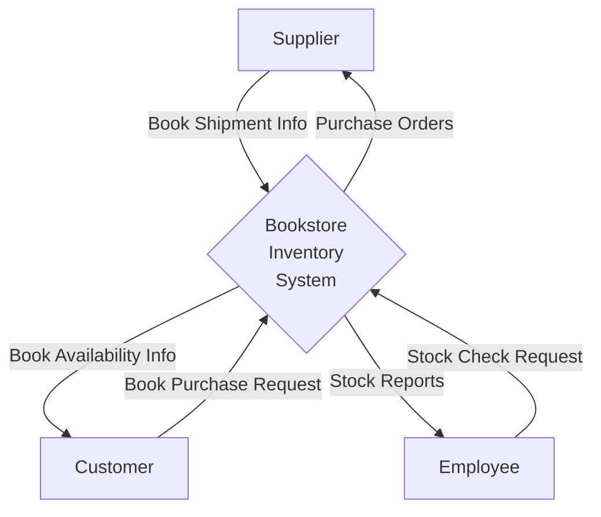
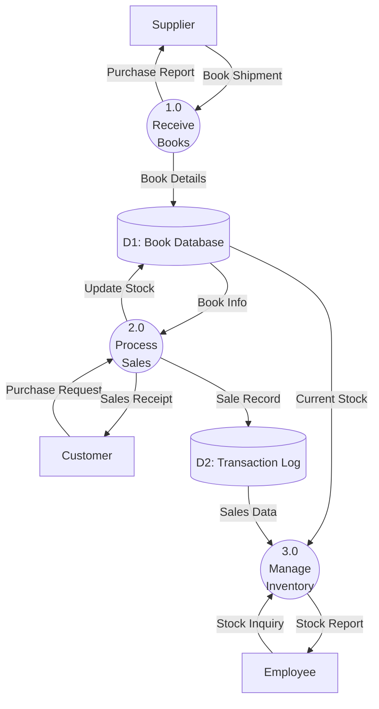
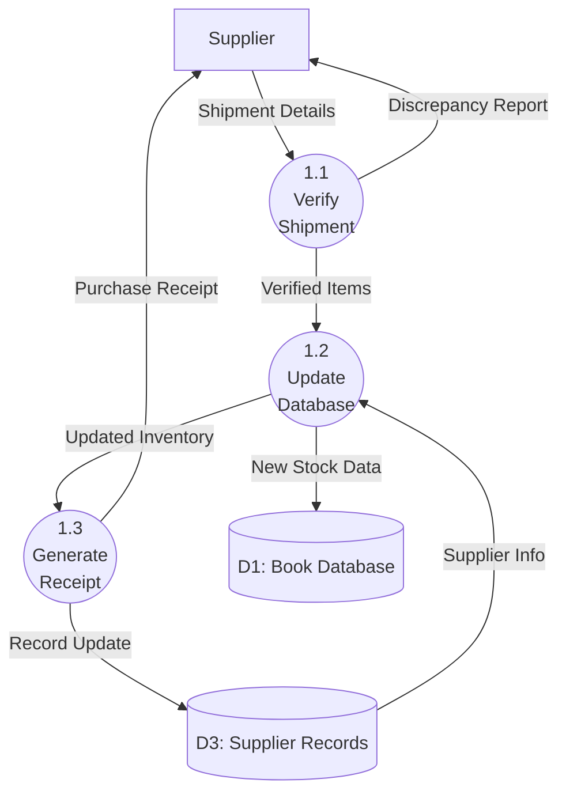
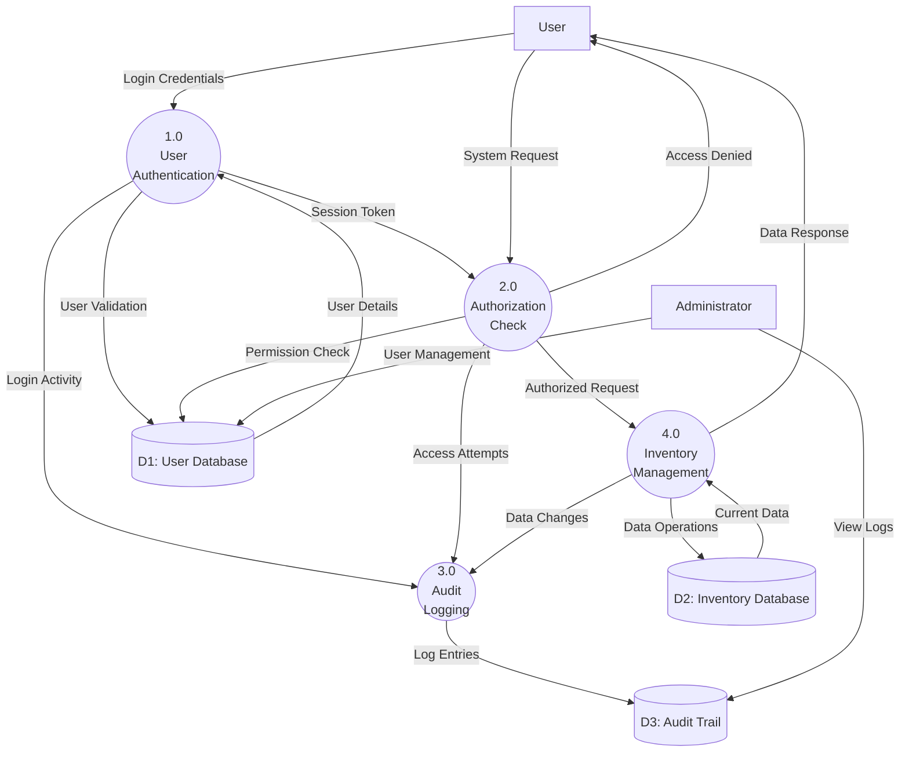
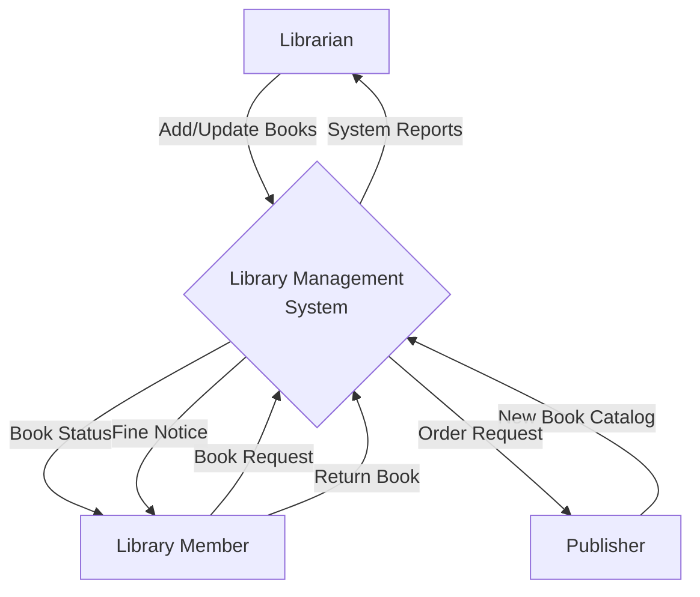

# Data Flow Diagram (DFD) Explained with Examples

Ever stared at a complex system and wondered how data moves through it? Where does information come from and where does it go? **Data Flow Diagrams (DFD)** help answer these questions.

DFD creates a roadmap for data—showing how information travels from point A to point B, gets processed, stored, and transformed along the way.

---

## What is a Data Flow Diagram (DFD)?

A **Data Flow Diagram (DFD)** is a graphical representation that shows how data moves through an information system. It illustrates the flow of data from input to output, through various processes that exist within the system.

In simple terms:

- **Visual representation** of data movement and transformation
- **Shows the logical flow** without getting into technical implementation details
- **Helps understand, analyze, and document** systems effectively
- **Focuses on data transformation** from one form to another

It's like creating a blueprint that shows how your system's "data plumbing" works—where data enters, how it gets processed, where it's stored, and where it exits.

**Sources:** [GeeksforGeeks DFD](https://www.geeksforgeeks.org/levels-in-data-flow-diagram-dfd/), [Gesaha Nelek Blog](https://gesahanelek.wordpress.com/2018/04/22/contoh-erd-dan-dfd-sistem-informasi-perpustakaan)

---

## Goals of Data Flow Diagrams

- **Document system requirements** → clear understanding of data needs
- **Analyze existing systems** → identify inefficiencies and improvements
- **Design new systems** → plan data flow before implementation
- **Communicate with stakeholders** → visual representation everyone can understand
- **Identify system boundaries** → what's inside and outside the system

Example benefits:

- **For developers**: Understand system architecture before coding
- **For business analysts**: Document business processes clearly
- **For project managers**: Communicate system scope to stakeholders

---

## Benefits of Using DFD

- **Visual clarity** → easier to understand than written descriptions
- **Structured analysis** → systematic approach to system design
- **Process identification** → clearly shows what the system does
- **Data store documentation** → identifies what data needs to be stored
- **Interface definition** → shows external entities and their interactions
- **Top-down approach** → start general, then get specific

**Extra Reading:** [Visual Paradigm DFD Guide](https://www.visual-paradigm.com/guide/data-flow-diagram/), [Lucidchart DFD Tutorial](https://www.lucidchart.com/pages/data-flow-diagram)

---

## DFD Basic Symbols and Components

Understanding DFD symbols is fundamental to reading any diagram:

### 1. External Entity (Terminator)

**Symbol**: Rectangle/Square
**Function**: Represents sources or destinations of data outside the system
**Examples**: Customer, Supplier, Government Agency, Other Systems

```
┌─────────────┐
│  Customer   │  ← External Entity
└─────────────┘
```

### 2. Process (Transform)

**Symbol**: Circle/Oval (or rounded rectangle)
**Function**: Represents activities that transform data input into data output
**Examples**: Calculate Total, Validate Order, Generate Report

```
    ┌─────────────┐
   ╱  Calculate   ╲  ← Process
  ╱     Total      ╲
 └─────────────────┘
```

### 3. Data Store (Repository)

**Symbol**: Two parallel lines or open rectangle
**Function**: Represents where data is stored (database, file, memory)
**Examples**: Customer Database, Inventory File, Order Archive

```
 ═══════════════════
 ║  Customer DB    ║  ← Data Store
 ═══════════════════
```

### 4. Data Flow (Connector)

**Symbol**: Labeled arrow
**Function**: Shows direction and type of data movement
**Examples**: Customer Info, Order Details, Payment Data

```
Customer Info
──────────────→  ← Data Flow
```

---

## DFD Levels Explained

DFDs follow a hierarchical structure:

### Context Diagram (Level 0)

- **Highest level** view of the system
- **Single process** representing the entire system
- Shows **external entities** and **major data flows**
- **System boundary** is clearly defined

**Example**: Inventory Management System


### Level 1 DFD

- **Breaks down** the single process from Level 0
- Shows **major functions** of the system
- **3-7 processes** (following 7±2 rule for readability)
- **Balanced** with Level 0 (same external entities and flows)

### Level 2+ DFD (Detailed Levels)

- **Further decomposition** of Level 1 processes
- Shows **detailed sub-processes**
- **Technical operations** and specific transformations
- Used when **more detail** is needed for implementation

---

## Detailed DFD Examples

### Level 0: Bookstore Inventory System




**Components Explained:**

- **External Entities**: Supplier, Customer, Employee
- **Main Process**: Bookstore Inventory System
- **Data Flows**: Purchase info, availability data, reports

### Level 1: Bookstore Inventory System Breakdown




### Level 2: "Receive Books" Process Detail




---

## Advanced DFD Concepts

### Modeling Conditional Logic ("If-Then" Scenarios)

When you need to show decision points:

**Method 1: Decision Process with Multiple Outputs**


**Method 2: Conditional Data Flows**

```
Order Request ──→ [Check Stock] ──→ Process Order (if_available)
                             │
                             └──→ Back Order (if_unavailable)
```

### Modeling Parallel Processes

When multiple processes run simultaneously:

**Fork/Join Pattern:**


**Independent Parallel Processes:**


---

## Security-Enhanced DFD Example

For systems requiring access control and audit trails:




---

## Common DFD Mistakes to Avoid

### What NOT to Do:

1. **Direct flows between external entities**

   ```
   Customer ──→ Supplier  (Missing process)
   ```

2. **Processes without inputs or outputs**

   ```
   [Isolated Process]  (No data flows)
   ```

3. **Data stores without access**

   ```
   [Unused Database]  (No read/write flows)
   ```

4. **Too many processes per level**
   ```
   [15 processes on one diagram]  (Cognitive overload)
   ```

### Best Practices:

1. **Balance between levels** → same external flows
2. **Use descriptive names** → "Process Order" not "P1"
3. **Follow 7±2 rule** → max 7 processes per diagram
4. **Use verb phrases for processes** → action-oriented naming
5. **Consistent numbering** → hierarchical process IDs
6. **Every data store accessed** → at least one in, one out

---

## Tools for Creating DFD

### Free Tools:

- **Draw.io (now diagrams.net)** → web-based, excellent for beginners
- **Lucidchart Free** → limited but functional
- **Pencil Project** → open-source desktop app

### Professional Tools:

- **Microsoft Visio** → industry standard
- **Lucidchart Pro** → collaborative features
- **Visual Paradigm** → comprehensive modeling suite
- **SmartDraw** → templates and automation

### Code-Based (Mermaid):


---

## When to Use DFD

### Perfect For:

- **System analysis and design** → understanding requirements
- **Business process documentation** → workflow visualization
- **Communication with stakeholders** → non-technical explanations
- **System integration planning** → interface identification
- **Legacy system documentation** → reverse engineering

### Consider Alternatives For:

- **Real-time systems** → use sequence diagrams
- **User interface design** → use wireframes/mockups
- **Object-oriented design** → use UML diagrams
- **Network architecture** → use network diagrams

---

## Step-by-Step DFD Creation Guide

### 1. Identify System Scope

- What's inside the system?
- What's outside (external entities)?
- What are the main functions?

### 2. Create Context Diagram (Level 0)

- Single process = your entire system
- Add external entities
- Draw major data flows

### 3. Decompose to Level 1

- Break main process into 3-7 sub-processes
- Add data stores
- Ensure balance with Level 0

### 4. Add Detail (Level 2+)

- Further decompose complex processes
- Add technical details
- Maintain consistency

### 5. Review and Validate

- Check for balanced flows
- Verify with stakeholders
- Document assumptions

---

## DFD vs Other Diagrams

| Diagram Type        | Purpose                  | Focus                        | When to Use                    |
| ------------------- | ------------------------ | ---------------------------- | ------------------------------ |
| **DFD**             | Data flow and processing | What the system does         | System analysis, documentation |
| **ERD**             | Data relationships       | How data is structured       | Database design                |
| **Flowchart**       | Process flow and logic   | Procedural steps             | Algorithm design               |
| **UML**             | Object-oriented design   | Classes and interactions     | OOP system design              |
| **Network Diagram** | System architecture      | Physical/logical connections | Infrastructure planning        |

---

## Complete Example: Library Management System

### Context Diagram:




This example shows a complete system with clear boundaries and data flows that could be further decomposed into detailed levels.

---

## Final Thoughts

Data Flow Diagrams are practical tools that help you:

- **Understand complex systems** before diving into code
- **Communicate clearly** with both technical and non-technical stakeholders
- **Design better systems** by thinking through data requirements first
- **Document existing systems** for future maintenance

Remember the DFD hierarchy:

1. **Context Diagram** → big picture view
2. **Level 1** → major system functions
3. **Level 2+** → detailed implementation

Start simple, add detail gradually, and always keep your audience in mind. A good DFD tells a story about how data moves through your system—make it a story worth reading!

---

Want to dive deeper? Check these resources:

- [Visual Paradigm DFD Guide](https://www.visual-paradigm.com/guide/data-flow-diagram/)
- [Lucidchart DFD Tutorial](https://www.lucidchart.com/pages/data-flow-diagram)
- [GeeksforGeeks DFD Levels](https://www.geeksforgeeks.org/levels-in-data-flow-diagram-dfd/)
- [Systems Analysis and Design Textbooks](https://www.google.com/search?q=systems+analysis+design+textbook)

---

**TL;DR:** DFD = visual roadmap for data flow. Start with context diagram, decompose logically, keep it balanced, and always validate with stakeholders.
