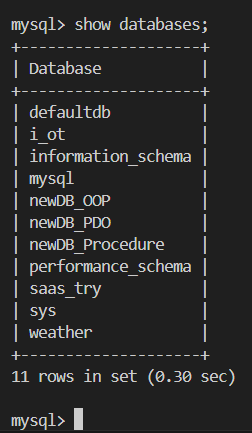
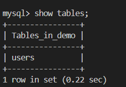
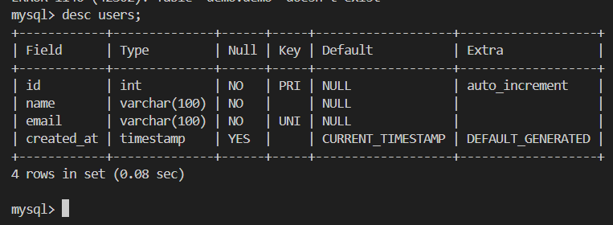

## Hello My Handsome Coders~

I'm back with a more interesting topic to discuss. Can you guess what it is? Well, of course, you can! It's already in the title. Have any of you started working on projects using databases? I hope you have because here I will show you some basic SQL scripts for relational databases.

But first, do you know what SQL is?

## SQL

SQL stands for Structured Query Language. It is a standard language for managing and manipulating relational databases. It is used to interact with databases by performing operations such as:

1. Data query (retrieving data)
2. Data insert (adding data)
3. Data update (modifying data)
4. Data delete (removing data)
5. Structure modification
6. Access control

SQL is used in relational database management systems (RDBMS) like MySQL, MariaDB, PostgreSQL, Microsoft SQL Server, and Oracle. It allows users to retrieve, store, and manage structured data efficiently.

So, what are the basic SQL scripts? First, make sure you have MySQL or another SQL database like MariaDB installed.

**Login Command**

Before using SQL, we must first log into MySQL.

```bash
mysql -h localhost -u root -p yourpassword
```

In this command, we can see the following components:

1. `mysql` --> the main command to indicate we want to log into MySQL.
2. `-h` --> short for host, followed by `localhost` indicating the host is the local MySQL server.
3. `-u` --> short for user, followed by `root` indicating the user is root.
4. `-p` --> indicating password, followed by your password. If your MySQL user doesn't have a password, there's no need to type `-p`.

This is what the terminal looks like when you are logged into MySQL:


**Listing Databases**

```sql
show databases;
```

That command will show the existing database.



If you don't have any you suppose to have one right? Here's how you make one:

**Creating Database**

```sql
create database demo;
```

**Switch Between Database**

If you have a database, you sure wanna change to it to start make your structure, you can use this command:

```sql
use demo;
```

It will switch you from MySQL main to your database.

**Making Table**

There are few things you should know about making a table:

1. The Tables

A table consists of columns (fields) and rows (records). Each column has a specific data type that defines what kind of data it can store, such as:

- int : (numbers for IDs, ages, etc)
- varchar(n) : (basically just string and text, e.g., names, emails)
- date
- boolean : (true or false)

2. Basic Syntax for creating table

Here's the example to make a table for user data:

```sql
-- Create a table named 'users'
create table users (
    -- Define an 'id' column of type integer, set it as the primary key, and enable auto-increment
    id int primary key auto_increment,

    -- Define a 'name' column of type varchar with a maximum length of 100 characters, and make it not nullable
    name varchar(100) not null,

    -- Define an 'email' column of type varchar with a maximum length of 100 characters, make it unique and not nullable
    email varchar(100) unique not null,

    -- Define a 'created_at' column of type timestamp with a default value of the current timestamp
    created_at timestamp default current_timestamp
);
```

3. Important Thing To Do When Making Tables

- Choosing the Right Data Types

Using the correct data type improves performance and ensures data integrity.

Example: - Use INT for numeric values (e.g., IDs). - Use VARCHAR for text instead of TEXT when possible, as it is more efficient. - Use DATETIME or TIMESTAMP for storing dates and times.

- Setting Primary Key

A primary key (PRIMARY KEY) uniquely identifies each record in the table. This prevents duplicate entries.

After making the table did you wondering how do we know if the table already created? If you do, well you can see it by:

```sql
show tables;
```



If you want to see the description and the strcuture of the tables you can use command:

```sql
desc the_table_name;
```



There are some other commands regarding table like:

1. Modifying structure

```sql
alter table your_table_name add column age int;
```

2. Deleting table permanently

```sql
drop table your_table_name;
```

Good, now you understand most of the basic thing about tables.. but did you notice about your users table now? It still empty! Maybe we need to insert data.

## Data Query

**Inserting Data**

```sql
-- Insert data into the 'users' table
-- This command inserts a new row into the 'users' table with the specified 'name' and 'email' values.
insert into users (name, email) values ('John Doe', 'john.doe@example.com');

-- This command inserts another new row into the 'users' table with the specified 'name' and 'email' values.
insert into users (name, email) values ('Jane Smith', 'jane.smith@example.com');

-- This command inserts yet another new row into the 'users' table with the specified 'name' and 'email' values.
insert into users (name, email) values ('Alice Johnson', 'alice.johnson@example.com');
```

Wait, did you notice sommething? If you do.. what is it?

Yess! We don't insert any data to the id and the created_at.. why? Because as we create the table earlier the auto_increment create the id automatically by adding one for every record while the created_at made automatically too using the current time when the data inserted.

Then.. how do we know the data already inserted? We can use query:

**Data retrieve**

1. Select all data

```sql
select * from your_table_name;
-- ex: select * from users;
```

2. Select specific columns

```sql
select name, email from your_table_name;
-- ex: select name, email from users;
```

3. Filtering data using `where`

```sql
select * from your_table_name where indicator;
-- ex: select * from users where age < 23
```

4. Sorting

```sql
select * from your_table_name order by indicator desc;
-- ex: select * from users order by age desc;
```

But.. what if you wanna edit the data?

**Data Update**

```sql
update your_table_name set indicator = value where indicator = value;
-- ex: update users set age = 20 where name = " Maria";
```

and.. what if you wanna delete the data?

**Data Deleting**

```sql
delete from your_table_name where indicator = value;
-- ex: delete from users where age = 20;
```

Delete all records: (dangerous, not really necessary)

```sql
delete from your_table_name;
-- ex: delete from users;
```

Huuft~ I think that's all from me.. right? Actually there are so many more commands and query but.. I think I can explain them more at another article.. see ya~

This article written by Rejaka Abimanyu Susanto, a Full-Stack Developer that reside in Yogyakarta, Indonesia. If you want to know more about me you can visit me at <a href="https://rejaka.id" target="_blank">rejaka.id</a>.
