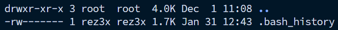

## Hello Coders :3

How you doing? I hope you all still living the life peacefully although those bunch of code make all of us crazy. By the way, is there any of you that still a newbie from using Linux based OS? and.. don’t even know how to make new file or directory? Well if you are.. good news! I’m here to assist you with that. In this article I will help you Coders to make and change permission & ownership of files & directories in Linux.

**Directory**

What is a directory? Well simply, in Windows it called folder. A directory contain files, it happened to be there to organize the files. Directory can contain files or other directories or even can be use to make shortcut.

How to make a directory? Well it simply, we can just use mkdir (make directory) command.

```bash
mkdir [your_directory_name]

```

**File**

File is a data that you stored in your computer. Of course you can make files in Linux and there are many ways to make files in Linux. In this article I will tell you Coders how to make a file through three ways.

1. Make a file using touch

```bash
touch [your_file_name]

```

If you using touch command to make file, you make the file as a blank file. So this file won’t have any data inside it.

2. Make a file using nano

nano is a terminal based text editor that often available in most of the Linux distributions. Nano is built in program so every time you install Linux based OS Nano will always be installed. To make file using nano you can just use nano command.

```bash
nano [your_file_name]

```

If you using nano command to make file, the nano program will automatically opened and you can add your data inside the file. The nano command have other function, it can be use to edit a file.

3. Make a file using cat

cat (concatenate/merge) is a program that can be used for many things including making, merging, and even showing the content of a file.

```bash
-c "cat > [your_file_name]"

```

cat works like nano, you can add the file content right away.

Now here we are, at the point where you Coders can finally make directory and file. But are you wondering how to check if the directory and the file already made? To check it, you can list all of the directories and files using command:

```bash
ls -lah

```



If the item has d letter in the left it means that item is a directory. If not that item is a file.

Hey, I have one more thing to tell you. Did you ever think of when you need to check what the file content but you don’t want to open it using text editor? Well, I have the answer for you Coders! There’s two way you can see what inside the file without needed to open it in editor mode.

1. less command

```bash
less [your_file_name]

```

cat command (yes cat really have many function)

```bash
cat [your_name_file]

```

Well, that’s all from me Coders. I hope this article will help your basic activity to using Linux based OS. Thanks for reading! See you at next article!

This article written by Rejaka Abimanyu Susanto, a Full-Stack Developer that reside in Yogyakarta, Indonesia. If you want to know more about me you can visit me at <a href="https://rejaka.id" target="_blank">rejaka.id</a>.
