# PHP game changer.. atleast that what they said

Hello folks! This time I come up with somehting new for you all.. PHP framework. Not so surprising I mean beside the fact that I don't really like to use PHP but well.. this one bit different and pretty neat actually. So what's the framework? Well of course by reading this blog title you guys already knew.. it's the game changer of PHP.. Laravel.

## 🔍 What's Laravel?

Laravel is a modern PHP web framework created by Taylor Otwell in 2011 to simplify web application development using clean, expressive syntax. It follows the MVC (Model-View-Controller) pattern and includes built-in features like routing, authentication, templating (Blade), database ORM (Eloquent), and a command-line tool (Artisan), making development faster and more organized.

## 💡 So what's so good about it?

Laravel makes web development **faster, cleaner, and more secure**. You don’t have to worry about low-level tasks like routing and authentication, it’s already taken care of. And thanks to tools like Eloquent (database ORM) and Artisan (CLI), development feels less like a chore.

Even better? Laravel has official **Starter Kits** like Breeze and Jetstream, which come with prebuilt auth, session management, and even frontend scaffolding. Wanna use React? Easy. Vue? No problem. Even SSR with Inertia.js? Laravel got your back.

Exciting isn't it? Wanna try this framework?? GOOD! I can help you with that! I'll help you to setup and start Laravel Project using Laravel Starter Kit, Composer and of course PHP in Linux Debian!

## ⚙️ Requirements

- 💻 Laptop/PC with Linux Debian OS
- 🌐 Internet Connection
- 🧠 Node.js (If you don't have it, check out my [Node.js NVM tutorial](https://rejaka.id/blog/nvmTutorial))

Ready? Then let's do this!!

## 🧱 Laravel Project Setup

### 🐘 PHP Installation

First of all, before jumping into Laravel first we need PHP. The legendary programming language that somehow still exist because of mostly legacy website codebase using this language and for the record it's very popular in the government infrastructure in my country and mostly PHP developer here have high pay grade (it's for real tho).

In this tutorial we'll use PHP 8.3. You guys may be asking why that spesific version? Why not use the latest 8.4? It's because my teacher said..

> "It's better to have one version older than latest because it's proved stable and already widely used."

Let’s go step-by-step:

1. Now for PHP 8.3 installation we need to refresh/update our package list and then install apt-transport-https lsb-release ca-certificates curl and gnupg.

```bash
sudo apt update
sudo apt install -y apt-transport-https lsb-release ca-certificates curl gnupg
```

2. Now for the PHP, we will use code repository maintain of Sury PPA actively maintain by Ondřej Surý’s. So now we will add the GPG key.

```bash
curl -fsSL https://packages.sury.org/php/apt.gpg | sudo gpg --dearmor -o /usr/share/keyrings/sury.gpg
```

3. After adding the source code repo then we list it to our source list of package manager.

```bash
echo "deb [signed-by=/usr/share/keyrings/sury.gpg] https://packages.sury.org/php/ $(lsb_release -sc) main" | sudo tee /etc/apt/sources.list.d/php.list
```

4. Let's update the package manager list and install PHP 8.3 by command:

```bash
sudo apt update
sudo apt install -y php8.3 php8.3-cli php8.3-mbstring php8.3-xml php8.3-curl php8.3-mysql php8.3-zip php8.3-readline unzip
```

5. Wait for the installation to be done then check for the PHP version.

```bash
php -v
```

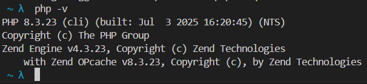

Boom. PHP is ready.

### 📦 Composer Installation

Now we install Composer. What’s Composer?

> It’s like NPM but for PHP. Manages your libraries, dependencies, and automates lots of boring stuff.

1. Download the Composer Installer (Composer Setup).

```bash
curl -sS https://getcomposer.org/installer -o composer-setup.php
```

2. Then install the Composer globally.

```bash
sudo php composer-setup.php --install-dir=/usr/local/bin --filename=composer
```

3. After the installation done, cleanup the setup file and validate bychecking the Composer version.

```bash
rm composer-setup.php
composer --version
```

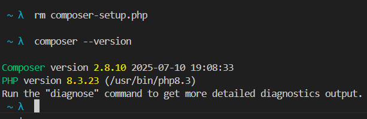

Composer installed successfully! Let’s keep moving.

### 🚀 Laravel Starter Kit & Project Creation

Now to the real fun, creating your Laravel project!

Why use Laravel Installer (Starter Kit)? It simplifies everything! It’s faster, cleaner, and gives you some helpful scaffolding.

1. Let’s install it:

```bash
composer global require laravel/installer
```

2. Wait a bit...

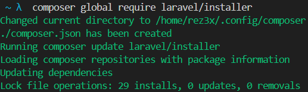

3.  Now create a folder for your project and dive in:

```bash
mkdir laravel_project && cd laravel_project
```

4. And finally, the magic command:

```bash
laravel new laravel_app
```

> Disclaimer: In this step there is error in mine which is caused because I use zsh terminal so here is the solution.

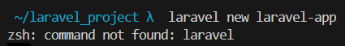

That’s because Zsh doesn’t know where the Laravel binary is. Let’s fix it.

### 🛠️ Add Laravel to PATH (For zsh user)

5. First, get the global binary path:

```bash
composer global config bin-dir --absolute
```

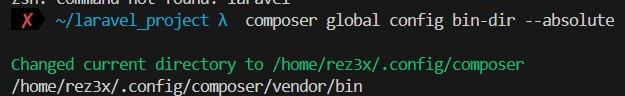

6. Copy that path and open .zshrc:

```bash
nano ~/.zshrc
```

7. Add this line at the bottom:

```bash
export PATH="$HOME/.config/composer/vendor/bin:$PATH"
```

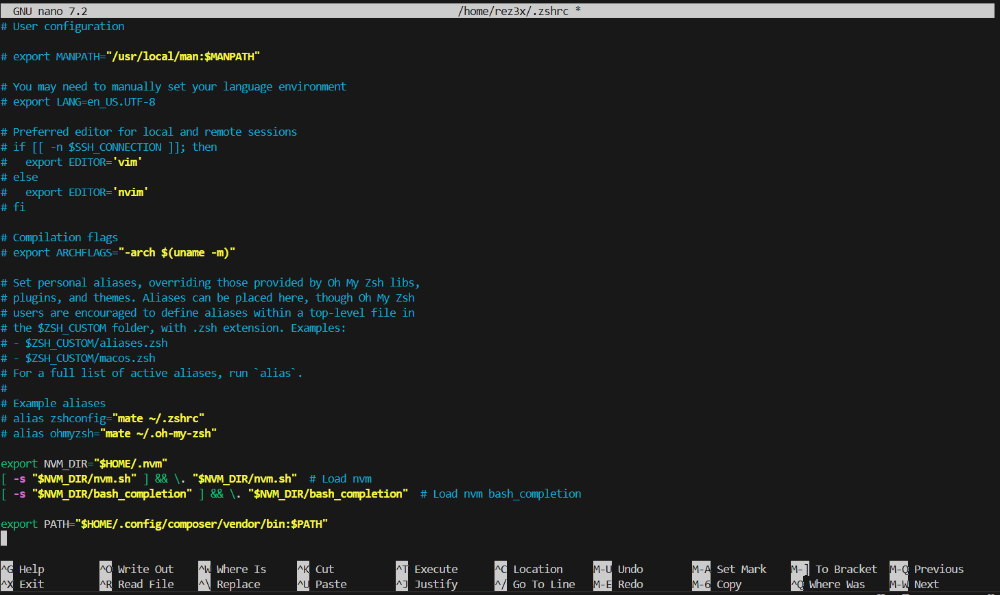

8. Save and apply the changes:

```bash
source ~/.zshrc
```

9. Verify everything’s okay:

```bash
laravel --version
```

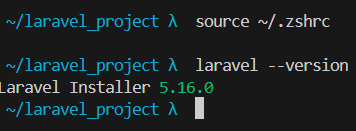

10. Perfect! Let’s retry the project creation:

```bash
laravel new laravel_app
```

### 🧩 Starter Kit Setup

Now the CLI will ask a few questions.

1. **Choose Starter Kit**. I picked React because I’m used to it.


12. **Auth Provider**. I went with Laravel’s Built-In Auth.

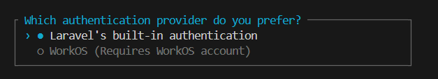

13. **Testing Framework**. I picked Pest, simple and elegant.

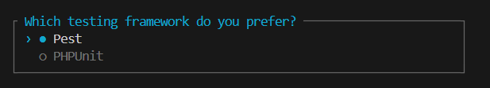

14. Wait for the setup to complete... 🎉

You’ll see the project folder:

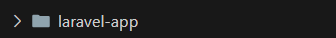

15. Then it’ll ask if you want to run "npm run dev" and "npm run build". Just type yes.

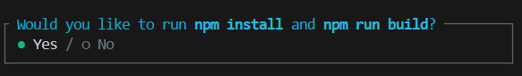

This is why we needed Node.js earlier. Laravel uses Vite to build assets and handle frontend stuff.

16. After some time, everything will be done.

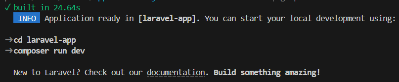

17. Check out the structure:

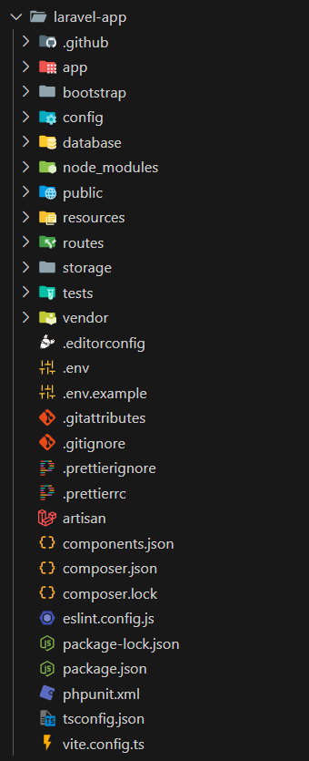

## 🎉 You're All Set!

Congrats! You just installed PHP, Composer, Laravel, and created your very first Laravel project on Debian Linux.

You’re now ready to code something amazing—go ahead and start your journey into the Laravel world 💻🔥

Got questions? Or maybe you wanna brag about your Laravel setup? Hit me up. And if you found this helpful, share it with your fellow dev friends!
