# MikroTik Firewall Filter Rules: Allow, Drop, and Access Control

NAT gets your clients on the internet. Firewall decides what they are actually allowed to do once they are there.

Those are two very different jobs, and understanding the difference matters. A lot of people set up NAT, verify that ping works, and call it done. But an unconfigured firewall means every port is open, every protocol is allowed, and anyone on the network can reach anything. In a production environment, that is a problem. Even in a lab, it is worth learning how to control traffic properly from the start.

This guide walks through a real two-router lab topology, builds up the full configuration from IP addresses to routing to NAT, and then focuses on what makes this lab different from the previous one: firewall filter rules on MikroTik.

---

## The Topology

This lab uses two routers chained together, with a PC client behind Router1 and Router2 connecting to the school/internet network.

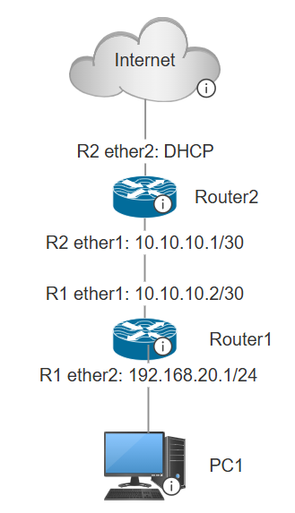

*Note: for Router1 ether1 and ether2 will be named ether5 and ether6 in the guide*

The `/30` subnet on the link between routers (`10.10.10.0/30`) is intentional. A `/30` gives exactly 4 IPs: the network address, two usable host addresses, and the broadcast. Perfect for a point-to-point link where only two devices need to talk.

```
10.10.10.0   → network address
10.10.10.1   → Router2 ether1
10.10.10.2   → Router1 ether5
10.10.10.3   → broadcast
```

The full IP scheme:

| Device    | Interface       | IP Address                  |
|-----------|-----------------|-----------------------------|
| PC Client | NIC             | DHCP (from Router1)         |
| Router1   | ether6          | 192.168.20.1/24             |
| Router1   | ether5          | 10.10.10.2/30               |
| Router2   | ether1          | 10.10.10.1/30               |
| Router2   | ether2          | DHCP from school/internet   |

---

## Step 1: Configure IP Addresses

### Router1

Router1 needs two static IPs, one for the LAN side and one for the link toward Router2.

Go to **IP → Addresses → New** and add both:

**ether5 (toward Router2):**
```
Address:   10.10.10.2/30
Network:   10.10.10.0
Interface: ether5
```

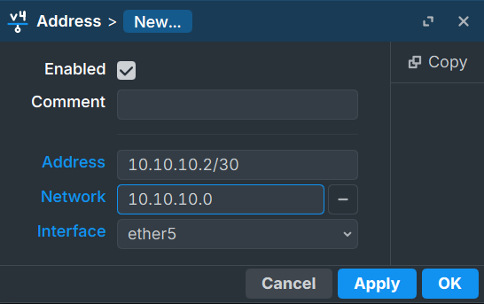

**ether6 (toward client):**
```
Address:   192.168.20.1/24
Network:   192.168.20.0
Interface: ether6
```

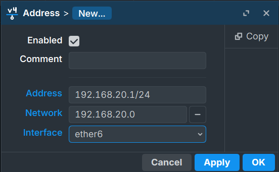

*Note: A note on the interface naming: in this lab, the CHR (Cloud Hosted Router) numbers interfaces starting from ether5. So what logically acts as ether1 (the WAN-facing link) is physically ether5, and what acts as ether2 (the LAN) is ether6. The configuration is the same, just keep the actual interface names in mind when entering settings.*

### Router2

Router2 also needs two interfaces configured, but one of them is static and one is dynamic.

**ether1 (toward Router1) — static:**

Go to **IP → Addresses → New**:
```
Address:   10.10.10.1/30
Network:   10.10.10.0
Interface: ether1
```


**ether2 (toward internet) — DHCP client:**

Go to **IP → DHCP Client → New**:
```
Interface:         ether2
Use Peer DNS:      enabled
Add Default Route: yes
```

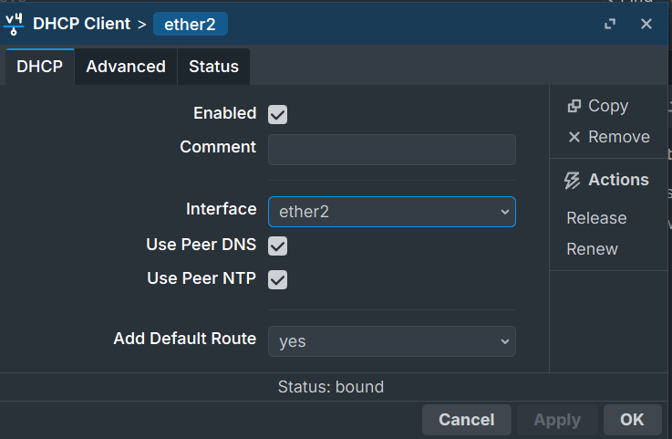

Once bound, Router2 will automatically receive an IP from the school network and install a default route pointing toward the internet. You can verify the dynamic IP appeared under **IP → Addresses**.

---

## Step 2: DHCP Server on Router1

Router1 serves IP addresses to the PC client through ether6. Run the DHCP wizard from **IP → DHCP Server → DHCP → DHCP Setup**.

Walk through each step:

**Interface:** `ether6`

**DHCP Address Space:** `192.168.20.0/24` (leave default)

**Gateway:** `192.168.20.1` (the ether6 IP)

**Addresses to Give Out:** `192.168.20.2 - 192.168.20.254` (leave default pool)

**DNS Servers:** leave default

**Lease Time:** leave default

After the wizard finishes, connect the PC client. Check **IP → DHCP Server → Leases**

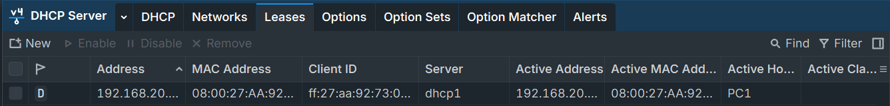

to confirm the client received an address. On the client side, running `ip a` should show something like:

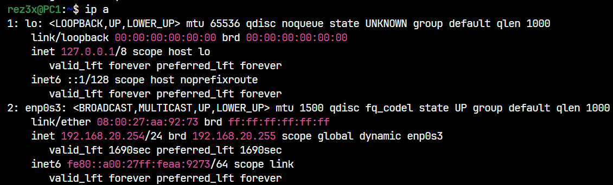

The client now has an IP and a gateway, but cannot reach the internet yet. Two things are still missing: routing and NAT.

---

## Step 3: Configure NAT on Router2

Router2 is the one with internet access, so NAT goes here. Go to **IP → Firewall → NAT → New**.

**General tab:**
```
Chain:          srcnat
Out. Interface: ether2
```

**Action tab:**
```
Action: masquerade
```

This tells Router2 to rewrite the source address of any packet leaving through ether2 to whatever IP is currently on that interface. Since ether2 gets its IP dynamically, masquerade is the right choice over a static src-nat rule.

---

## Step 4: Configure Static Routes

Even with NAT in place, the client still cannot reach the internet because Router1 does not know where to send traffic that is not destined for its local network. You need to add static routes on both routers.

### Router1: Default Route

Router1 needs a catch-all route that sends everything it does not know about toward Router2. Go to **IP → Routes → New**:

```
Dst. Address: 0.0.0.0/0
Gateway:      10.10.10.1
```

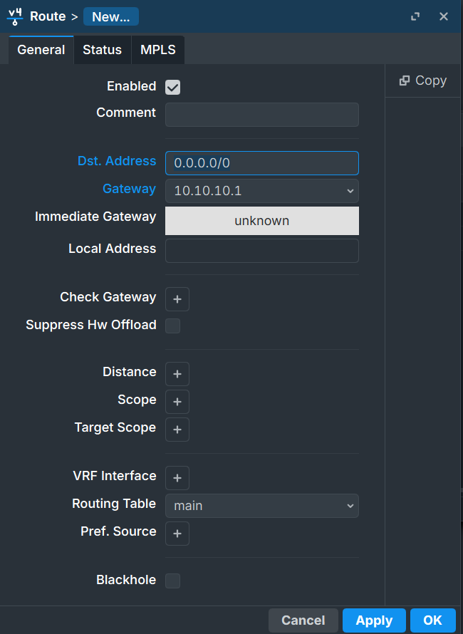

`0.0.0.0/0` matches every destination. The gateway `10.10.10.1` is Router2's ether1 address, the next hop toward the internet.

### Router2: Return Route

Router2 needs to know how to reach the client network `192.168.20.0/24`. Without this, reply packets from the internet would arrive at Router2 but it would not know how to forward them back toward the client. Go to **IP → Routes → New**:

```
Dst. Address: 192.168.20.0/24
Gateway:      10.10.10.2
```

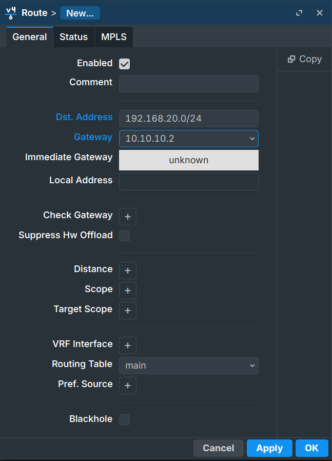

`10.10.10.2` is Router1's ether5 address, pointing back toward the LAN.

### Verify Routing Works

At this point, the client should be able to ping through Router2. From the client:

```bash
ping [ROUTER1_IP_ADDRESS]
```

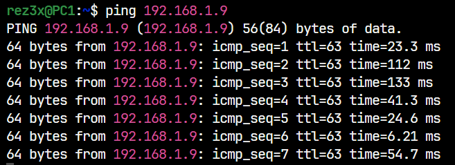

Basic connectivity works. Now for the firewall.

---

## Understanding MikroTik Firewall

Before writing any rules, it helps to understand the three chains and what they actually mean.

### The Three Chains

MikroTik's firewall processes packets based on their direction relative to the router itself.

**INPUT** handles traffic destined for the router. If someone pings the router's own IP, or connects to Winbox or SSH, that goes through input.

**FORWARD** handles traffic passing through the router from one interface to another. Client traffic going to the internet passes through forward on every router it crosses.

**OUTPUT** handles traffic originating from the router itself. If the router pings something, that goes through output.

```
Client → [Router] → Internet   =  FORWARD chain
Client → [Router's IP]         =  INPUT chain
[Router] → Something           =  OUTPUT chain
```

In this lab, all firewall rules go in the **forward** chain on Router2, because that is where client traffic crosses when heading to the internet.

### Accept vs Drop

**accept** lets the packet through and stops processing further rules.

**drop** silently discards the packet. The sender receives no response, which also reveals less information to potential attackers.

### Rule Order Matters

MikroTik processes firewall rules from top to bottom and stops at the first match. This is called first-match-wins.

This means rule ordering is not just organizational, it is functional. An accept rule at the top takes priority over any drop rule below it for matching traffic. A drop rule placed too high blocks things you intended to allow.

The standard pattern is always: **accept specific things first, drop everything else last.**

---

## Step 5: Configure Firewall Rules

The goal for this lab:

1. Clients can browse the web (HTTP/HTTPS must work)
2. Clients cannot ping outside the network (ICMP blocked)
3. One specific IP (`8.8.8.8`) is still allowed to be pinged (exception before the block)

All rules go on **Router2** under **IP → Firewall → Filter Rules**. Go to New for each one.

### Rule 1: Allow ping to 8.8.8.8

This creates a specific exception for ICMP traffic destined for `8.8.8.8`. It must be placed before the drop rule or it will never be reached.

**General tab:**
```
Chain:          forward
Dst. Address:   8.8.8.8
Out. Interface: ether2
```

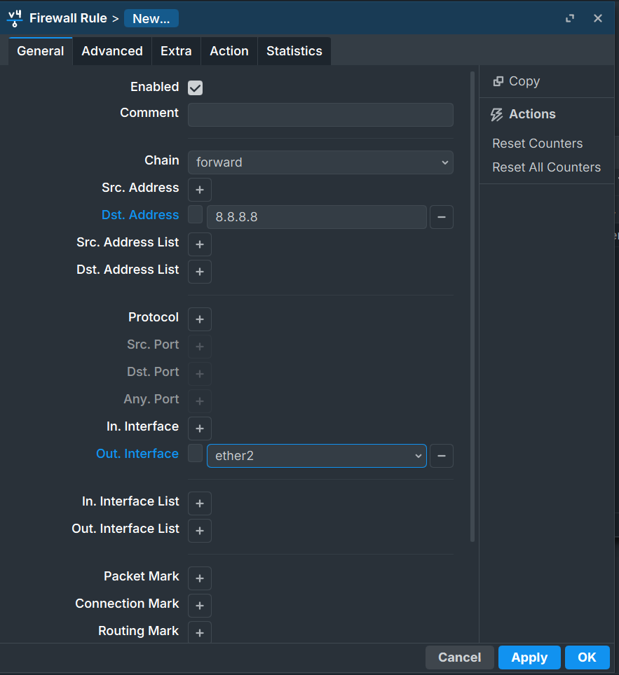

**Action tab:**
```
Action: accept
```

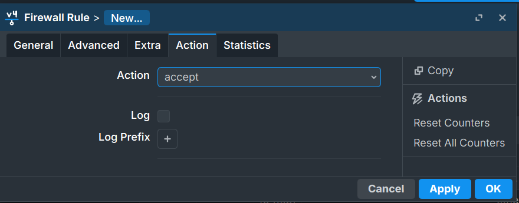

### Rule 2: Drop all non-TCP traffic

This rule drops everything going out through ether2 that is not TCP. Since ICMP (ping) is not TCP, it gets dropped. Since HTTP and HTTPS are TCP, browsing still works.

The key detail here is the `!` negation on the protocol field. In Winbox, when you select the protocol, there is a `!` button you can toggle to invert the match. So instead of "match TCP," you set it to "match everything that is NOT TCP."

**General tab:**
```
Chain:          forward
Protocol:       ! 6 (tcp)    ← everything EXCEPT TCP
Out. Interface: ether2
```

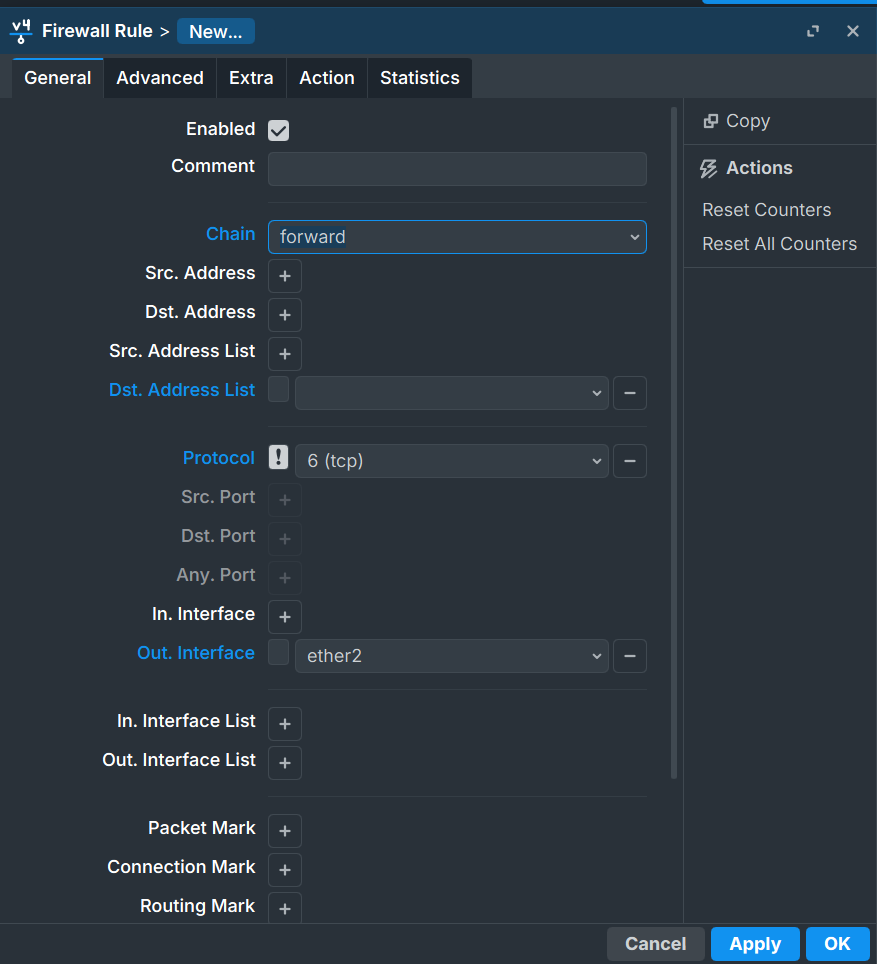

**Action tab:**
```
Action: drop
```

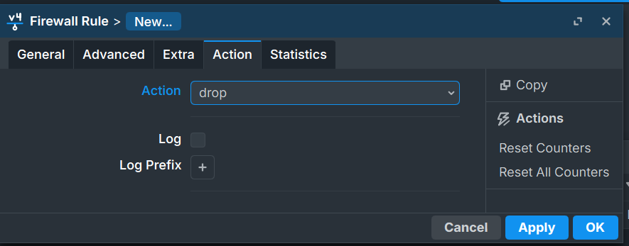

### Final Rule Order

After both rules are created, the list should look like this:

```
# 0  accept   forward   dst-address=8.8.8.8          out-interface=ether2
# 1  drop     forward   protocol=!tcp                 out-interface=ether2
```

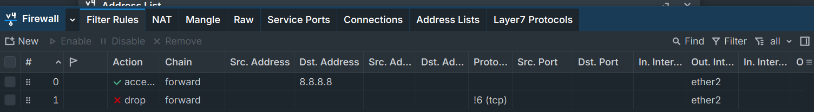

Rule 0 is checked first. Ping to `8.8.8.8` matches and gets accepted, rule 1 is never checked for it. Everything else that is not TCP hits rule 1 and gets dropped. TCP traffic (including ping to `8.8.8.8` which already got accepted) passes through normally.

---

## Testing the Rules

### Test 1: Web browsing (should work)

```bash
lynx https://rejaka.id/resume
```

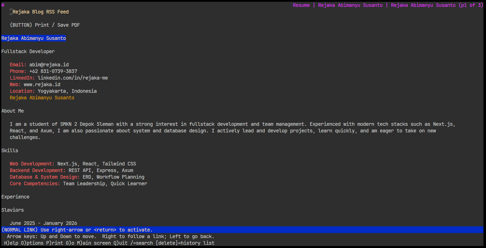

The page loads. HTTPS is TCP, so it does not match the drop rule and reaches the internet fine.

### Test 2: Ping to a general address (should fail)

```bash
ping 1.1.1.1

PING 1.1.1.1 (1.1.1.1) 56(84) bytes of data.
^C

--- 1.1.1.1 ping statistics ---
12 packets transmitted, 0 received, 100% packet loss, time 11239ms
```

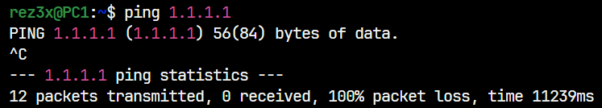

ICMP is not TCP. It does not match rule 0 (wrong destination). It matches rule 1 (not TCP) and gets dropped. 100% packet loss confirms it is working.

### Test 3: Ping to the allowed address (should work)

```bash
ping 8.8.8.8

PING 8.8.8.8 (8.8.8.8) 56(84) bytes of data.
64 bytes from 8.8.8.8: icmp_seq=1 ttl=247 time=108 ms
64 bytes from 8.8.8.8: icmp_seq=2 ttl=247 time=95.5 ms
64 bytes from 8.8.8.8: icmp_seq=3 ttl=247 time=103 ms

4 packets transmitted, 4 received, 0% packet loss
```

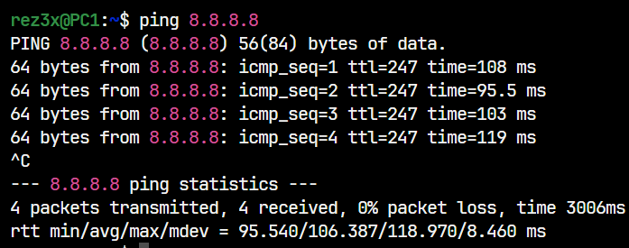

Rule 0 catches this before rule 1 can drop it. Ping succeeds.

All three behaviors match the intended policy.

---

## NAT vs Firewall

Since both live under the same IP → Firewall menu in MikroTik, it is easy to think they are the same thing. They are not.

**NAT** modifies packet addresses. It does not decide whether a packet is allowed or blocked. It just changes the source or destination address on the way through. NAT is translation, not filtering.

**Firewall filter rules** decide whether a packet is allowed to pass at all. They do not modify anything. They inspect packets based on criteria and either accept or drop them.

In practice, NAT runs before firewall filtering in the packet path. A packet can go through NAT translation and still get dropped by a filter rule afterward.

```
Packet arrives
    → NAT table (address modification)
    → Filter table (allow or block)
    → Forwarded or dropped
```

You need both working correctly. NAT without a firewall gives you internet access with no traffic controls. A firewall without NAT gives you filtering but private addresses still cannot reach the public internet.

---

## Why Bad Rule Order Breaks Everything

This deserves its own section because the consequences can range from mildly annoying to genuinely destructive in a production network.

MikroTik uses first-match-wins. The moment a packet matches a rule, that rule's action is applied and processing stops. Rules below it are never seen for that packet.

**Scenario 1: Drop rule placed above the accept exception**

```
# 0  drop     forward   protocol=!tcp    out-interface=ether2
# 1  accept   forward   dst-address=8.8.8.8
```

Ping to `8.8.8.8` arrives. Rule 0 matches (ICMP is not TCP). Dropped. Rule 1 is never reached. The exception does nothing.

**Scenario 2: Accidental input drop with no exceptions**

```
# 0  drop     input     (no conditions)
```

This drops every packet going to the router itself. Winbox disconnects. SSH disconnects. You are locked out. Recovery requires physical console access or a device reset.

The safe approach every time: write your specific accept rules first, verify they work, then add the broad drop at the bottom.

---

## Summary

This lab chains together everything from the previous NAT lab and adds access control on top. The IP configuration establishes addresses, DHCP distributes them automatically, static routes tell each router where to forward traffic it does not own, NAT translates private addresses to public ones, and firewall filter rules define exactly what that traffic is allowed to do.

The firewall concepts that carry forward: the chain determines where in the traffic flow the rule applies. The action determines what happens to matching packets. Rule order determines which rule wins when multiple could match. And specific rules must always come before general ones, or the general rule takes over and the specific one never runs.

---

**Further Reading**

- [MikroTik Firewall Filter Documentation](https://wiki.mikrotik.com/wiki/Manual:IP/Firewall/Filter)
- [MikroTik Static Routing](https://wiki.mikrotik.com/wiki/Manual:IP/Route)
- [MikroTik RouterOS Packet Flow](https://wiki.mikrotik.com/wiki/Manual:Packet_Flow_v6)
- [MikroTik DHCP Server](https://wiki.mikrotik.com/wiki/Manual:IP/DHCP_Server)

---

*This article was written by Rejaka Abimanyu Susanto, a full-stack developer based in Yogyakarta, Indonesia. For more articles on networking and web development, visit [rejaka.id](https://rejaka.id).*