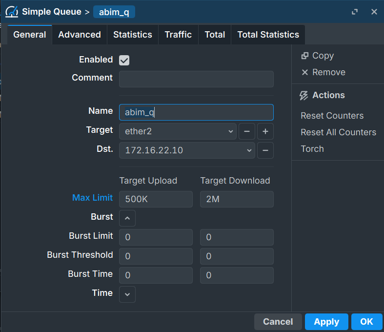
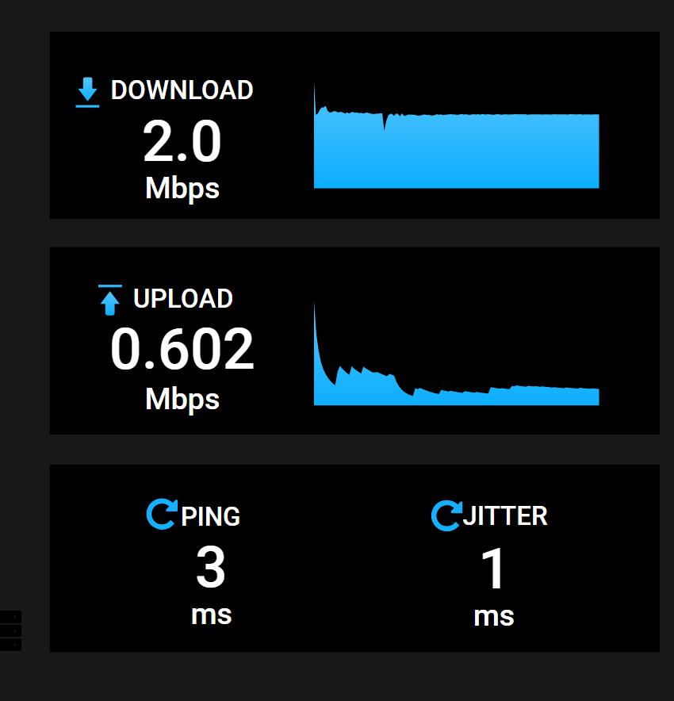
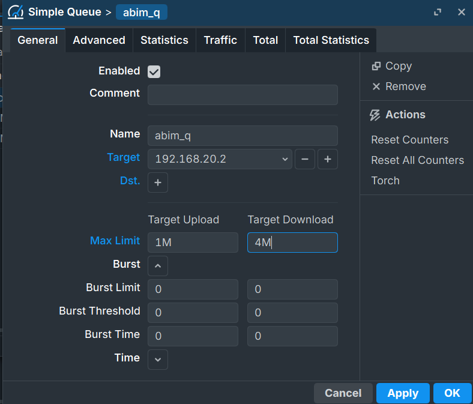
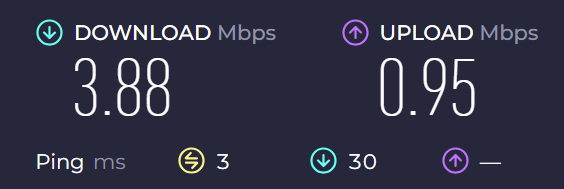

# MikroTik QoS with Simple Queue: Bandwidth Control That Actually Works

Every network has a bandwidth limit. The question is not whether that limit exists, it is who decides how it gets used.

Without any QoS configuration, whoever sends the most traffic wins. One device doing a large file transfer can starve everyone else on the same network. Video calls stutter, pages load slowly, and the experience degrades for everyone except the one hogging the pipe.

Quality of Service, or QoS, is how a network administrator takes back that control. It lets you define who gets how much bandwidth, enforce upload and download maximums, and scope those limits to specific destinations or the entire internet. This guide covers Simple Queue on MikroTik, the most practical starting point for bandwidth management.

---

## What QoS Actually Does

When a packet arrives at a router faster than it can be forwarded, it goes into a queue. Without QoS, that queue is first-in-first-out: whoever sent first gets forwarded first, and everyone else waits. When the queue fills up, packets get dropped.

QoS introduces discipline into that queue. Instead of pure first-in-first-out, the router can:

- Limit how fast a specific client or subnet can send or receive
- Scope limits to traffic going toward a specific destination
- Apply different limits to different clients on the same network

On MikroTik, all of this happens through the **Queue** system, found under **Queues** in Winbox.

---

## Simple Queue

Simple Queue is the straightforward way to rate-limit traffic on MikroTik. You define a target, set upload and download maximums, and the router enforces those limits for matching traffic.

The configuration is minimal and the behavior is easy to reason about: traffic from or to the target gets capped at the specified rates. No complex hierarchy, no shared pools.

### The Key Fields

**Name** — just a label for the rule. Make it descriptive.

**Target** — what you are limiting. Can be a single IP (`192.168.20.2`), a subnet (`192.168.20.0/24`), or an interface name like `ether2`.

**Dst** (Destination) — optionally, the remote address this limit applies to. If left empty, the limit applies to all destinations. If set to a specific IP, the rule only activates when the target is communicating with that address. This is useful for scoping limits to a specific server, like an internal speed test endpoint.

**Max Limit** — the hard ceiling for upload and download separately. Traffic above this rate gets dropped or delayed until it fits within the limit.

A note on direction: **upload** means traffic going from the client out toward the internet. **Download** means traffic coming from the internet toward the client. Both are set independently, which lets you model the asymmetric connections that are common in real deployments.

---

## Activity 1: Simple Queue with a Destination

The first use case limits an entire subnet, but only when traffic is headed to a specific server. This is a clean way to control bandwidth usage to a particular endpoint without affecting other traffic.

**Configuration:**
- Target: `192.168.20.0/24` (the whole LAN via ether2)
- Upload limit: 500 Kbps
- Download limit: 2 Mbps
- Destination: `172.16.22.10` (a local speed test server)

Go to **Queues → Simple Queues → New**:

```
Name:               abim_q
Target:             ether2
Dst:                172.16.22.10
Max Limit Upload:   500K
Max Limit Download: 2M
```



With this rule active, any device in the `192.168.20.0/24` network is limited to 500 Kbps upload and 2 Mbps download, but only when communicating with `172.16.22.10`. Traffic to any other destination flows without restriction from this rule.

Running a speed test against that server from a client shows results close to the configured limits:



The download hits almost exactly 2 Mbps. The upload comes in just above 500 Kbps, which is expected since speed test measurements carry their own protocol overhead on top of the raw data.

---

## Activity 2: Simple Queue for a Specific Client

The second configuration moves away from destination-scoped limiting and instead gives a specific client its own dedicated limit that applies to all traffic, regardless of where it is going.

This is the more common pattern in practice. You assign limits per user or per device, and the limit covers their entire internet usage rather than just traffic to one server.

**Configuration:**
- Target: `192.168.20.2` (one specific PC)
- Upload limit: 1 Mbps
- Download limit: 4 Mbps
- Destination: (empty, applies to all traffic)

Add a second Simple Queue rule:

```
Name:               abim_q
Target:             192.168.20.2
Dst:                (empty)
Max Limit Upload:   1M
Max Limit Download: 4M
```



Running an internet speed test from that client shows:



Close to the 4M/1M limits. The small gap below the maximum is normal. Real throughput rarely hits exactly the configured ceiling because TCP itself has overhead, and the speed test server introduces its own timing variability.

---

## Rule Order and Overlapping Targets

When you have multiple Simple Queue rules, MikroTik processes them from top to bottom and applies the first matching rule to each packet.

This matters a lot when rules overlap. In the two configurations above, `192.168.20.2` is a member of the `192.168.20.0/24` subnet. If the subnet rule sits above the specific IP rule in the list, then traffic from `192.168.20.2` matches the subnet rule first and the specific rule never runs.

The fix is straightforward: put more specific rules above broader ones.

```
# Rule 0 (more specific, must be first):
Target: 192.168.20.2 → Max: 1M upload / 4M download

# Rule 1 (broader, applies to everyone else):
Target: ether2 (192.168.20.0/24) → Max: 500K upload / 2M download
```

With this order, `192.168.20.2` matches rule 0 and gets its 1M/4M limit. Every other device in the subnet falls through to rule 1 and gets 500K/2M. The logic is clean and the order makes the intent readable.

---

## What Happens Without QoS

It is worth being concrete about why this matters. On a network without any queue rules:

- A single device running a large download can saturate the uplink, making everything else sluggish
- There is no way to enforce fair usage policies
- Heavy users consume as much as the connection allows, regardless of what other clients need
- You have no visibility into which clients are consuming the most bandwidth

Simple Queue does not solve every bandwidth problem, but it gives you direct, enforceable control over how much any given client or subnet can use. For a school lab, a small office, or a shared connection with multiple users, that control is the difference between a usable network and a chaotic one.

---

## Common Mistakes

**Putting the broad subnet rule above the specific IP rule**

As covered above, the first matching rule wins. A subnet rule placed above a specific IP rule will catch the specific IP before the more targeted rule ever runs. Always check your rule order when behavior does not match expectations.

**Confusing upload and download direction**

MikroTik's upload and download labels follow the client's perspective. Upload is traffic leaving the client toward the internet. Download is traffic arriving at the client from the internet. This is intuitive for users but worth confirming when you are setting asymmetric limits.

**Forgetting that a subnet target is a combined limit**

A rule targeting `192.168.20.0/24` applies the limit as a total for all devices in that subnet together, not per device. If you want each device to have its own 2 Mbps download limit, you need a separate rule per device. If you want the whole subnet to share a 2 Mbps pool, the subnet target is correct.

**Setting 0 in the Max Limit fields**

Leaving Max Limit at 0 in MikroTik means unlimited. If you intend to cap traffic, make sure both upload and download fields have actual values. A rule with 0 in either field effectively has no limit in that direction.

---

## Summary

Simple Queue is the most direct tool MikroTik provides for bandwidth control. The concept is straightforward: pick a target, set limits, and the router enforces them. The destination field adds another dimension by letting you scope limits to specific servers rather than all traffic.

The two patterns covered here, destination-scoped subnet limiting and per-client limiting, cover most real-world use cases. Understanding rule order is the one thing that trips most people up, but once that clicks, Simple Queue becomes a reliable and readable way to manage how a network's bandwidth gets distributed.

---

**Further Reading**

- [MikroTik Queue Documentation](https://wiki.mikrotik.com/wiki/Manual:Queue)
- [MikroTik Simple Queue Examples](https://wiki.mikrotik.com/wiki/Manual:Queue#Simple_Queues)
- [MikroTik Queues Overview](https://help.mikrotik.com/docs/display/ROS/Queues)

---

*This article was written by Rejaka Abimanyu Susanto, a full-stack developer based in Yogyakarta, Indonesia. For more articles on networking and web development, visit [rejaka.id](https://rejaka.id).*