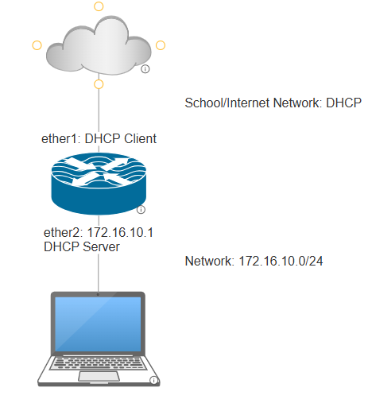
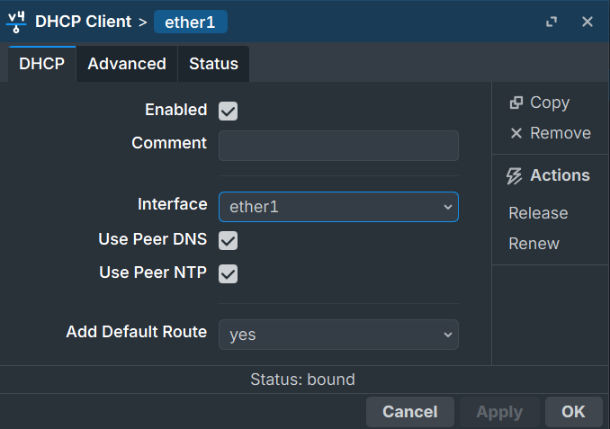
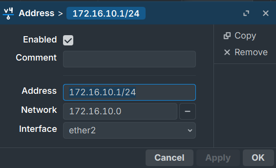
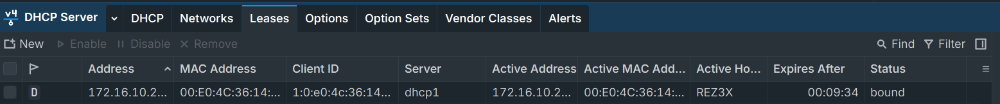
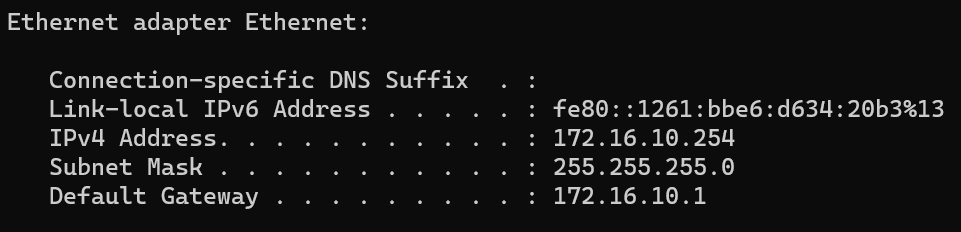
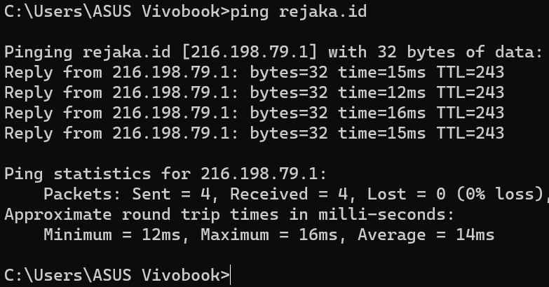

# NAT on MikroTik Explained: Source NAT, Destination NAT, and Masquerade

Your laptop sits on a local network with an IP address like `172.16.10.254`. That address means nothing to the internet. The internet has never heard of it, and it never will, because private IP addresses are not routable outside your local network.

Yet somehow, you open a browser and Google loads just fine.

That happens because of **NAT**, or Network Address Translation. It is one of the most quietly essential things happening in every home router, every office network, and every lab setup you will ever build. This article explains what NAT actually does, covers the two main types (srcnat and dstnat), and walks through a real MikroTik configuration using the exact topology from a hands-on lab.

---

## The Problem NAT Solves

The IPv4 address space has roughly 4.3 billion addresses. That sounds like a lot until you realize there are far more devices connected to the internet than that. The solution, which has kept the internet running for decades while IPv6 slowly rolls out, is a split between **public** and **private** IP addresses.

**Private IP ranges** (defined in RFC 1918):

```
10.0.0.0/8        → Class A private
172.16.0.0/12     → Class B private
192.168.0.0/16    → Class C private
```

These addresses are free to use inside any local network. The catch is that internet routers will not forward packets carrying these addresses as a source. They are intentionally unreachable from outside.

**Public IP addresses** are globally unique, assigned by ISPs, and actually routable on the internet.

NAT bridges the gap. It sits at the edge of your network, between the private side (LAN) and the public side (WAN/internet), and translates addresses on packets as they cross that boundary.

---

## How NAT Works

When a device on your LAN sends a request to the internet, the packet carries a private source IP. NAT intercepts that packet at the router and rewrites the source address to the router's public IP before sending it out.

When the reply comes back, NAT reverses the process: it sees the destination address (the router's public IP), looks up which internal device made the original request, and rewrites the destination to that device's private IP before forwarding it inward.

```
LAN device          Router (NAT)              Internet server
172.16.10.254  -->  rewrites src to           216.198.79.1
               <--  rewrites dst back
```

From the internet server's perspective, it is only ever talking to the router's public IP. The private addresses behind it are completely invisible.

---

## Two Types of NAT

### Source NAT (srcnat)

Source NAT modifies the **source address** of outgoing packets. This is what allows multiple devices on a private network to share a single public IP and access the internet.

When a packet leaves your LAN heading toward the internet, srcnat changes the source IP from the device's private address to the router's public-facing IP.

Use srcnat when: devices on your local network need to reach the internet or an external network.

### Destination NAT (dstnat)

Destination NAT modifies the **destination address** of incoming packets. This is used to forward traffic from outside your network to a specific internal server.

The classic use case is port forwarding. Say you are running a web server at `172.16.10.10:80` inside your LAN. Dstnat lets you tell the router: "any traffic arriving on your public IP at port 80, forward it to `172.16.10.10:80`."

Use dstnat when: you want external traffic to reach a specific device inside your private network.

```
srcnat → outgoing traffic, changes source address
dstnat → incoming traffic, changes destination address
```

---

## Masquerade: The Smart Version of srcnat

When configuring srcnat on MikroTik, you have a few action options. The most common one for internet access is **masquerade**.

Here is what makes masquerade different from a plain `src-nat` action:

With a basic `src-nat`, you specify a fixed IP address to translate to. This works when your public IP is static and never changes.

With `masquerade`, MikroTik automatically uses whatever IP address is currently assigned to the outgoing interface. If your WAN interface gets a new IP from your ISP's DHCP server, masquerade adapts instantly with no rule changes needed.

```
src-nat    → you manually specify the public IP (good for static IPs)
masquerade → automatically uses the current outgoing interface IP (good for dynamic IPs)
```

For most real-world setups where the WAN IP comes from DHCP, masquerade is the right choice.

---

## The Lab Setup

This is the topology used in the hands-on lab. A MikroTik router connects to the school/internet network on one side and serves a local client network on the other.



The goal: the client laptop on the `172.16.10.0/24` network can reach the internet, even though it only has a private IP.

---

## Step 1: Configure the Interfaces

### ether1 (DHCP Client)

ether1 connects to the school network and needs an IP from the upstream DHCP server. Go to **IP → DHCP Client** and add a new entry with interface set to `ether1`.

Settings to use:
- Interface: `ether1`
- Use Peer DNS: enabled
- Use Peer NTP: enabled
- Add Default Route: `yes`



Once bound, MikroTik will automatically receive an IP address from the school network and set up a default route through it. You can verify this under **IP → Addresses** where ether1 will show a dynamic address.

### ether2 (LAN - Static IP)

ether2 faces your local client network. It needs a static IP that will serve as the gateway for all clients.

Go to **IP → Addresses**, add a new address:

```
Address:   172.16.10.1/24
Network:   172.16.10.0
Interface: ether2
```



This makes the router the gateway for the `172.16.10.0/24` network.

---

## Step 2: Configure the DHCP Server

With ether2 having a static IP, you can now run a DHCP server on it to hand out addresses to clients automatically.

Go to **IP → DHCP Server → DHCP → DHCP Setup** and walk through the wizard:

**Step 1 - Select interface:** `ether2`

**Step 2 - DHCP Address Space:** `172.16.10.0/24` (leave default)

**Step 3 - Gateway for DHCP Network:** `172.16.10.1` (the ether2 IP)

**Step 4 - Addresses to Give Out:** `172.16.10.2 - 172.16.10.254` (leave default pool)

**Step 5 - DNS Servers:** leave as default (it will inherit from the upstream DNS learned via ether1)

**Step 6 - Lease Time:** `00:10:00` (leave default for lab purposes)

After finishing the wizard, connect a client device to ether2. It should receive an IP in the `172.16.10.x` range with gateway `172.16.10.1`.

You can confirm this under **IP → DHCP Server → Leases**, where the client's MAC address and assigned IP should appear with status `bound`.



On the client side, `ipconfig` should show:



At this point, the client can reach the router at `172.16.10.1`, but it still cannot reach the internet. The private IP has no way out yet.

---

## Step 3: Configure NAT (Source NAT with Masquerade)

This is the key step. Without it, the client sends packets out but nothing replies, because the source IP `172.16.10.x` is meaningless on the internet.

Go to **IP → Firewall → NAT** and add a new rule.

### General Tab

```
Chain:         srcnat
Out. Interface: ether1
```

Setting `chain` to `srcnat` tells MikroTik this rule handles outgoing packets. Setting the out interface to `ether1` means the rule only applies to traffic leaving through the WAN interface toward the internet. Traffic staying within the LAN is not affected.

Leave all other fields (Src. Address, Dst. Address, Protocol, etc.) empty. This makes the rule apply to all traffic going out through ether1 regardless of source.

### Action Tab

```
Action: masquerade
```

That is all. Masquerade will automatically replace the source IP of any outgoing packet with the current IP on ether1, making it look like the traffic is coming from the router itself.

Click **Apply** and **OK**.

---

## Testing Connectivity

With NAT configured, the client should now have full internet access.

**Test 1: Ping an external host**

```
ping rejaka.id
```



Replies confirm the traffic is going out and coming back. DNS resolution is also working since the hostname resolved correctly.

**Test 2: Browse the web**

Open any website from the client. If pages load, NAT is working correctly.

---

## What Happens Without NAT

If you skip the NAT rule entirely, here is what happens:

1. Client sends a request to `216.198.79.1` with source IP `172.16.10.254`
2. The router forwards the packet to the school network
3. The school network router receives a packet from `172.16.10.254` and tries to send a reply
4. It cannot, because `172.16.10.254` is a private address. There is no route back to it.
5. The reply never arrives. The client just times out.

The client can still ping the router itself (`172.16.10.1`) because that is local traffic that never crosses the NAT boundary. But anything beyond the router is unreachable.

---

## Bonus: A Quick Look at Destination NAT (dstnat)

The lab above only covers srcnat, but understanding dstnat rounds out the picture.

Imagine you want to host a web server inside your LAN at `172.16.10.10` and make it accessible from the internet on port 80.

The dstnat rule would look like this:

```
Chain:        dstnat
Protocol:     tcp
Dst. Port:    80
In. Interface: ether1

Action:       dst-nat
To Addresses: 172.16.10.10
To Ports:     80
```

Now when a request hits the router's public IP on port 80, MikroTik rewrites the destination to `172.16.10.10` and forwards it inward to the internal server.

Combined with srcnat, you get a complete picture:

```
srcnat  → your clients go out to the internet
dstnat  → outside traffic comes in to your servers
```

Most home and small office setups only need srcnat. Dstnat becomes relevant the moment you want to expose any internal service to the outside world.

---

## Summary

NAT solves the fundamental problem of too many devices and not enough public IP addresses. By sitting at the edge of your network and translating addresses on packets in both directions, it lets an entire office or school network share a single public IP.

The core concepts to carry forward: srcnat handles outgoing traffic and makes your private devices look like the router to the internet. Dstnat handles incoming traffic and routes it to specific internal devices. Masquerade is the srcnat action to use when your WAN IP is dynamic, because it adapts automatically without any manual reconfiguration.

In MikroTik, the entire configuration comes down to three fields: the chain, the interface, and the action. Get those right and everything else follows.

---

**Further Reading**

- [MikroTik NAT Documentation](https://wiki.mikrotik.com/wiki/Manual:IP/Firewall/NAT)
- [RFC 1918 - Address Allocation for Private Internets](https://www.rfc-editor.org/rfc/rfc1918)
- [MikroTik DHCP Server Documentation](https://wiki.mikrotik.com/wiki/Manual:IP/DHCP_Server)

---

*This article was written by Rejaka Abimanyu Susanto, a full-stack developer based in Yogyakarta, Indonesia. For more articles on networking and web development, visit [rejaka.id](https://rejaka.id).*