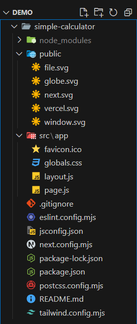
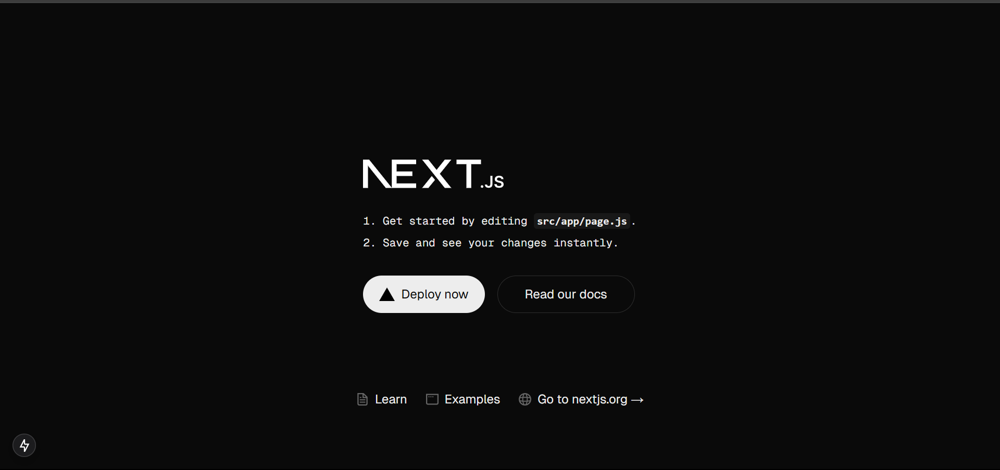
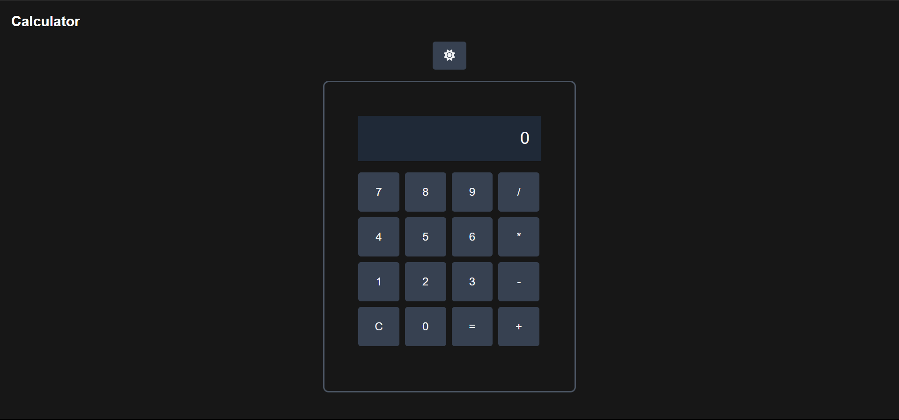

## Hello My Cute Coders :3

At the previous article I told you guys how to start with NextJS but have any of you wonder.. what you should do next? or you all Coders don't know what to make? If you guys ask me.. why not choose something eqasy first.. Like.. a calculator? Simple project isn't it? If you guys ready.. follow me!

## Setting The NextJS

Make sure you already have NodeJS, if not you can visit <a href="https://blog.rejaka.id/posts/nvmtutorial/" target="_blank"> Easy Way To Install NVM On Your Linux Device</a>.

Open your terminal.

```bash
npx create-next-app@latest simple-calculator --eslint

```

```bash
Ok to proceed? (y) #y
? Would you like to use TypeScript? › No / Yes #No, since we just started. We start from easy first
? Would you like to use Tailwind CSS? › No / Yes #Yes, I suggest use TailwindCSS for easier styling
? Would you like your code inside a `src/` directory? › No / Yes #Yes
? Would you like to use App Router? (recommended) › No / Yes #Yes, the App Router is the newer version of router in NextJS
? Would you like to use Turbopack for `next dev`? › No / Yes #Yes
? Would you like to customize the import alias (`@/*` by default)? › No / Yes #No, default is better

```

Here's the first look of your workspace.



Change to your directory.

```bash
cd simple-calculator

```

Then run the command to see the preview of your NextJS website.

```bash
npm run dev

```

It will log your local development server, usually localhost:3000. You can go to your browser and use that to see the preview.

Here's your initial preview.



Open new terminal, install theese package:

```bash
npm install npm install @fortawesome/fontawesome-svg-core @fortawesome/free-solid-svg-icons @fortawesome/react-fontawesome
```

Before we do any coding, first we need to list what the feature. Here some of the feature I want to add to our simple calculator:

1. Basic math operation
2. Font Size Change Depending On Line Lenght
3. Light and Dark Theme

After that, delete all the code inside your page.js inside src/app directory. Then let's start make our calculator!

## page.js

1. Importing Dependancies

```javascript
"use client"; //This tells Next.js that this file runs on the client side, allowing the use of React hooks like useState and useEffect

import { useState, useEffect } from "react"; //React hooks used for state management and side effects.
import { FontAwesomeIcon } from "@fortawesome/react-fontawesome"; //A component from FontAwesome used to display icons.
import { faSun, faMoon } from "@fortawesome/free-solid-svg-icons"; //Icons for light and dark mode switching.
```

2. Defining the Home Component

```javascript
export default function Home() { //This is the main React component, named Home. It is exported as the default component of this file.
```

3. Defining State Variables

```javascript
const [input, setInput] = useState(""); //Stores the current calculator input.
const [result, setResult] = useState(""); //Stores the calculation result.
const [fontSize, setFontSize] = useState("text-2xl"); //Adjusts the font size dynamically based on input length.
const [isDarkMode, setIsDarkMode] = useState(true); //Determines whether dark mode is enabled.
```

4. Adjusting Font Size Based on Input Length

```javascript
useEffect(() => {
  //useEffect runs every time input changes. The font size is reduced when the input becomes too long.
  if (input.length > 10) {
    setFontSize("text-xl");
  } else if (input.length > 15) {
    setFontSize("text-lg");
  } else {
    setFontSize("text-2xl");
  }
}, [input]);
```

5. Dark Mode Toggle Effect

```javascript
useEffect(() => {
  //This useEffect runs whenever isDarkMode changes. It updates the <html> element to add/remove the dark class, enabling dark mode styles.
  const htmlElement = document.documentElement;
  if (isDarkMode) {
    htmlElement.classList.add("dark");
  } else {
    htmlElement.classList.remove("dark");
  }
}, [isDarkMode]);
```

6. Handling Calculator Button Clicks

```javascript
const handleButtonClick = (value) => {
  //Handles calculator button clicks based on their values.
  if (value === "=") {
    //Evaluates the expression using eval(), showing an error if invalid.
    try {
      setResult(eval(input));
    } catch {
      setResult("Error");
    }
    setInput("");
  } else if (value === "C") {
    //Clears the input and result.
    setInput("");
    setResult("");
  } else {
    const lastChar = input.slice(-1);
    const isOperator = ["+", "-", "*", "/"].includes(value);
    const isLastCharOperator = ["+", "-", "*", "/"].includes(lastChar);

    if (isOperator && isLastCharOperator) {
      //Prevents consecutive operators (e.g., ++ or --).
      setInput(input.slice(0, -1) + value);
    } else if (isOperator && input === "") {
      setInput(result + value);
    } else {
      setInput(input + value);
    }
  }
};
```

7. Toggling Between Light and Dark Mode

```javascript
const toggleTheme = () => {
  //This function toggles the isDarkMode state when the theme button is clicked.
  setIsDarkMode(!isDarkMode);
};
```

8. JSX - The Return Statement

```javascript
return ( //The main container is a flexbox-centered layout. Uses Tailwind CSS for spacing, padding, and dark mode compatibility.
  <div className="flex flex-col items-center mt-[-50px] justify-center min-h-screen p-4 bg-background text-foreground">
```

9. Dark Mode Toggle Button

```javascript
<button
  onClick={toggleTheme} //Calls toggleTheme() when clicked. Shows a sun or moon icon based on isDarkMode.
  className="mb-4 p-2 w-12 rounded bg-gray-200 dark:bg-gray-700 text-gray-900 dark:text-gray-100 transition-colors duration-300"
>
  <FontAwesomeIcon icon={isDarkMode ? faSun : faMoon} />
</button>
```

10. Calculator Display Area

```javascript
//Displays the current input and result. The font size is dynamically adjusted based on fontSize.
<div className="w-[360px] border-2 border-gray-400 dark:border-gray-600 rounded-lg p-12">
  <div className="p-4 border-b border-gray-300 dark:border-gray-700 bg-gray-200 dark:bg-gray-800">
    <div className={`text-right ${fontSize} text-gray-900 dark:text-gray-100 overflow-hidden`}>{input || "0"}</div>
    <div className="text-right text-2xl text-gray-600 dark:text-gray-400">{result}</div>
  </div>
```

11. Calculator Buttons Grid

```javascript
<div className="grid grid-cols-4 gap-2 p-4 w-[290px] ml-[-16px]">
```

12. Rendering Calculator Buttons

```javascript
{
  ["7", "8", "9", "/"].map(
    (
      item //Loops through an array of button labels and renders them dynamically. Calls handleButtonClick(item) when clicked
    ) => (
      <button
        key={item}
        className="p-4 border rounded bg-gray-300 dark:bg-gray-700 text-gray-900 dark:text-gray-100"
        onClick={() => handleButtonClick(item)}
      >
        {item}
      </button>
    )
  );
}
```

13. Full code

```javascript
"use client";

import { useState, useEffect } from "react";
import { FontAwesomeIcon } from "@fortawesome/react-fontawesome";
import { faSun, faMoon } from "@fortawesome/free-solid-svg-icons";

export default function Home() {
  const [input, setInput] = useState("");
  const [result, setResult] = useState("");
  const [fontSize, setFontSize] = useState("text-2xl");
  const [isDarkMode, setIsDarkMode] = useState(true);

  useEffect(() => {
    if (input.length > 10) {
      setFontSize("text-xl");
    } else if (input.length > 15) {
      setFontSize("text-lg");
    } else {
      setFontSize("text-2xl");
    }
  }, [input]);

  useEffect(() => {
    const htmlElement = document.documentElement;
    if (isDarkMode) {
      htmlElement.classList.add("dark");
    } else {
      htmlElement.classList.remove("dark");
    }
  }, [isDarkMode]);

  const handleButtonClick = (value) => {
    if (value === "=") {
      try {
        setResult(eval(input));
      } catch {
        setResult("Error");
      }
      setInput("");
    } else if (value === "C") {
      setInput("");
      setResult("");
    } else {
      const lastChar = input.slice(-1);
      const isOperator = ["+", "-", "*", "/"].includes(value);
      const isLastCharOperator = ["+", "-", "*", "/"].includes(lastChar);

      if (isOperator && isLastCharOperator) {
        setInput(input.slice(0, -1) + value);
      } else if (isOperator && input === "") {
        setInput(result + value);
      } else {
        setInput(input + value);
      }
    }
  };

  const toggleTheme = () => {
    setIsDarkMode(!isDarkMode);
  };

  return (
    <div className="flex flex-col items-center mt-[-50px] justify-center min-h-screen p-4 bg-background text-foreground">
      <button
        onClick={toggleTheme}
        className="mb-4 p-2 w-12 rounded bg-gray-200 dark:bg-gray-700 text-gray-900 dark:text-gray-100 transition-colors duration-300"
      >
        <FontAwesomeIcon icon={isDarkMode ? faSun : faMoon} />
      </button>
      <div className="w-[360px] border-2 border-gray-400 dark:border-gray-600 rounded-lg p-12">
        <div className="p-4 border-b border-gray-300 dark:border-gray-700 bg-gray-200 dark:bg-gray-800">
          <div
            className={`text-right ${fontSize} text-gray-900 dark:text-gray-100 overflow-hidden`}
          >
            {input || "0"}
          </div>
          <div className="text-right text-2xl text-gray-600 dark:text-gray-400">
            {result}
          </div>
        </div>
        <div className="grid grid-cols-4 gap-2 p-4 w-[290px] ml-[-16px]">
          {["7", "8", "9", "/"].map((item) => (
            <button
              key={item}
              className="p-4 border rounded bg-gray-300 dark:bg-gray-700 text-gray-900 dark:text-gray-100"
              onClick={() => handleButtonClick(item)}
            >
              {item}
            </button>
          ))}
          {["4", "5", "6", "*"].map((item) => (
            <button
              key={item}
              className="p-4 border rounded bg-gray-300 dark:bg-gray-700 text-gray-900 dark:text-gray-100"
              onClick={() => handleButtonClick(item)}
            >
              {item}
            </button>
          ))}
          {["1", "2", "3", "-"].map((item) => (
            <button
              key={item}
              className="p-4 border rounded bg-gray-300 dark:bg-gray-700 text-gray-900 dark:text-gray-100"
              onClick={() => handleButtonClick(item)}
            >
              {item}
            </button>
          ))}
          {["C", "0", "=", "+"].map((item) => (
            <button
              key={item}
              className="p-4 border rounded bg-gray-300 dark:bg-gray-700 text-gray-900 dark:text-gray-100"
              onClick={() => handleButtonClick(item)}
            >
              {item}
            </button>
          ))}
        </div>
      </div>
    </div>
  );
}
```

Now, while our little calculator can be use now. It still doesn't have the theme changing, so let's fix that. Go to the globals.cssa and follow my lead!

## globals.css

1. Tailwind Directives

```css
/*These are Tailwind CSS directives that inject Tailwind's base styles, reusable components, and utility classes.*/
@tailwind base;
@tailwind components;
@tailwind utilities;
/*
@tailwind base; → Loads essential global styles like resets and default typography.
@tailwind components; → Allows defining custom reusable Tailwind components.
@tailwind utilities; → Loads Tailwind’s utility classes like text-center, bg-red-500, etc.
*/
```

2. Root Variables (CSS Custom Properties)

```css
:root {
  /*The :root selector applies styles globally to the entire document. Variables (prefixed with --) store colors for easy reuse.*/
  --background: #beb9b9;
  --foreground: #171717;
  --button-bg: #e0e0e0;
  --button-bg-hover: #d0d0d0;
  --button-text: #000000;
}
```

3. Dark Mode Styles

```css
.dark {
  /*When the .dark class is added to the html element (by JavaScript), it switches to dark mode.*/
  --background: #171717;
  --foreground: #ffffff;
  --button-bg: #333333;
  --button-bg-hover: #444444;
  --button-text: #ffffff;
}
```

4. Body Styling

```css
body {
  color: var(--foreground);
  background: var(--background);
  font-family: Arial, Helvetica, sans-serif;
  overflow-y: hidden;
}
```

5. Button Styling

```css
button {
  background: var(--button-bg);
  color: var(--button-text);
  border: none;
  padding: 10px;
  border-radius: 5px;
  cursor: pointer;
  transition: background 0.3s;
}
```

6. Button Hover Effect

```css
button:hover {
  background: var(--button-bg-hover);
}
```

7. Full CSS

```css
@tailwind base;
@tailwind components;
@tailwind utilities;

:root {
  --background: #beb9b9;
  --foreground: #171717;
  --button-bg: #e0e0e0;
  --button-bg-hover: #d0d0d0;
  --button-text: #000000;
}

.dark {
  --background: #171717;
  --foreground: #ffffff;
  --button-bg: #333333;
  --button-bg-hover: #444444;
  --button-text: #ffffff;
}

body {
  color: var(--foreground);
  background: var(--background);
  font-family: Arial, Helvetica, sans-serif;
  overflow-y: hidden;
}

button {
  background: var(--button-bg);
  color: var(--button-text);
  border: none;
  padding: 10px;
  border-radius: 5px;
  cursor: pointer;
  transition: background 0.3s;
}

button:hover {
  background: var(--button-bg-hover);
}
```

Good! Now the calculator has more style, but.. it seem the theme still not working. Well.. there is one last thing we need to set up.

## tailwind.config.mjs

```javascript
export default {
  darkMode: "class", //It enables dark mode using the 'class' strategy, meaning users can toggle dark mode by adding the dark class to the <html> tag.
  content: ["./src/app/**/*.{js,ts,jsx,tsx,mdx}"],
  theme: {
    extend: {
      //The theme.extend property customizes the default Tailwind theme by adding light mode and dark mode color schemes.
      colors: {
        light: {
          background: "#ffffff",
          foreground: "#171717",
        },
        dark: {
          background: "#0a0a0a",
          foreground: "#ededed",
        },
      },
    },
  },
  plugins: [],
};
```

Huuft.. finally. I think our calculator is done now. You can see it right?



That's all from me, see you at next article!

## Source Code

Get the code <a href="https://github.com/REZ3X/NextJS-Simple-Calculator-Demo-Tutorial-JS" target="_blank"> here</a>.

This article written by Rejaka Abimanyu Susanto, a Full-Stack Developer that reside in Yogyakarta, Indonesia. If you want to know more about me you can visit me at <a href="https://rejaka.id" target="_blank">rejaka.id</a>.
