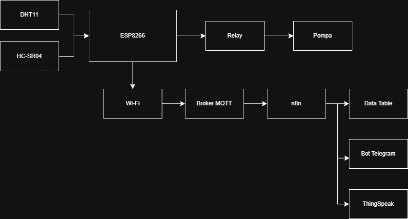
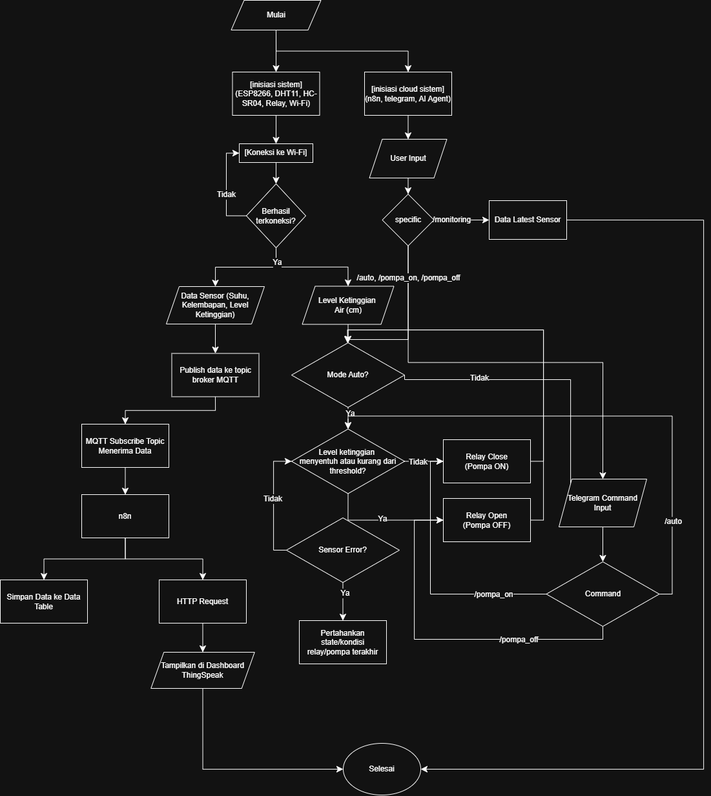
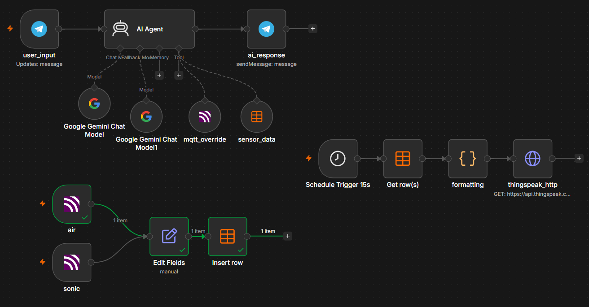
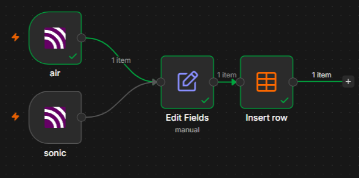
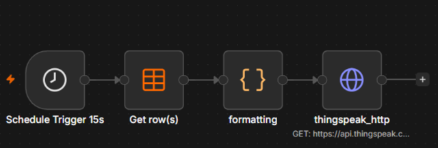
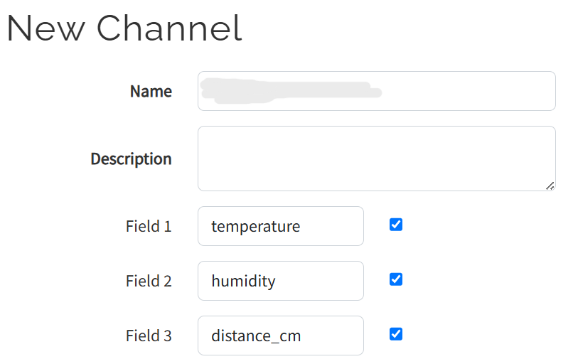
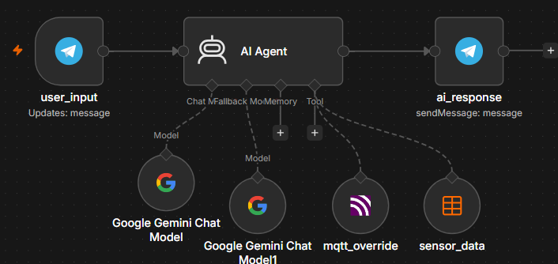

# Smart Hydroponic: IoT-Based Monitoring and Control System

Hydroponic farming is growing fast as a modern cultivation method that does not require large land and can be done at home. But managing a hydroponic system manually is still the main daily challenge for independent growers.

You have to check the temperature, humidity, and nutrient water level repeatedly. When you are at work, traveling, or asleep, that monitoring gets skipped. And even a short delay in refilling the nutrient tank or letting the temperature climb too high is enough to damage plant growth — or cause a total crop failure.

IoT solves this. With an ESP8266, a couple of sensors, and a few cloud services wired together, the system monitors the hydroponic environment 24/7 without you being there. Sensor data flows to n8n and ThingSpeak for storage and visualization. You monitor and control the pump from your phone through a Telegram bot backed by an AI model.

This guide walks through the full build: hardware wiring, MicroPython firmware, n8n workflow, ThingSpeak dashboard, and Telegram bot with Gemini AI integration.

---

## The System Overview

The project covers these features:

- Temperature and humidity detection
- Water level detection
- Automatic pump control that turns off when the tank is full
- Remote monitoring via Telegram bot
- Manual pump override via Telegram
- Online dashboard on ThingSpeak



The block diagram above shows how everything connects. DHT11 and HC-SR04 feed into the ESP8266, which controls the relay and pump directly. On the data side, the ESP8266 connects over Wi-Fi to an MQTT broker, which feeds n8n. From n8n, data goes to the Data Table, Bot Telegram, and ThingSpeak.

**Hardware used:**

|       Component       |               Spec               |              Role              |
|-----------------------|----------------------------------|--------------------------------|
| ESP8266               | Dual-core, WiFi built-in, 3.3V   | Main microcontroller           |
| DHT11                 | Temp: -40~80°C, Humidity: 0~100% | Air temperature and humidity   |
| HC-SR04               | Range: 2cm~400cm                 | Nutrient water level           |
| Relay Module          | 3.3V single channel, 10A 250VAC  | Pump on/off control            |
| Submersible Mini Pump | 3-5V DC, mini submersible        | Pumps nutrient water to plants |
| Breadboard            | 830 tie-points                   | Prototyping                    |

**Software and services:**

MicroPython, Thonny IDE, MQTT Broker, n8n, Gemini AI, Telegram Bot, ThingSpeak.

---

## Wiring

All components connect to the ESP8266 on a breadboard.

|      Component       |   Pin   | ESP8266 Pin |
|----------------------|---------|-------------|
| HC-SR04              | VCC     | VIN         |
| HC-SR04              | TRIGGER | D4          |
| HC-SR04              | ECHO    | D5          |
| HC-SR04              | GND     | GND         |
| DHT11                | VCC     | 3V3         |
| DHT11                | OUT     | D8          |
| DHT11                | GND     | GND         |
| Relay                | VCC     | 3V3         |
| Relay                | IN      | D3          |
| Relay                | GND     | GND         |
| Relay                | COM     | 3V3         |
| Relay NO + Mini Pump | —       | —           |

The HC-SR04 measures the distance from the sensor (mounted above the tank) down to the water surface. A small distance means the tank is full. A large distance means the tank is running low. The threshold is set at 10 cm — below that, tank is considered full and the pump turns off.

One thing worth noting on the wiring table: HC-SR04 VCC goes to **VIN**, not 3V3. The HC-SR04 is a 5V sensor. Running it on 3.3V causes frequent read errors. VIN on the ESP8266 carries the raw input voltage (~5V from USB), which is what the sensor actually needs. More on why this creates its own problem in the [Known Issues](#known-issues) section.

---

## System Flow



The flowchart shows both sides of the system running in parallel. On the left, the ESP8266 boots, connects to Wi-Fi, reads sensors, publishes to MQTT, and n8n picks it up for storage and ThingSpeak forwarding. On the right, the cloud side handles user input from Telegram — routing commands like `/monitoring`, `/pompa_on`, `/pompa_off`, and `/auto` to the appropriate actions.

The auto pump logic in the middle is the core of the firmware loop: check if auto mode is on, check the distance reading, turn the pump on or off accordingly. If the sensor returns an error, the pump holds its last known state rather than making a wrong decision with bad data.

---

## Firmware

The firmware runs on MicroPython and is split into library modules under `lib/`.

### WiFi Connection

```python
WIFI_SSID = "ssid"
WIFI_PASS = "password"

import network
import time

class WiFiManager:
    def __init__(self, ssid, password):
        self.ssid = ssid
        self.password = password

    def connect(self):
        wlan = network.WLAN(network.STA_IF)
        wlan.active(True)
        if not wlan.isconnected():
            wlan.connect(self.ssid, self.password)
            while not wlan.isconnected():
                time.sleep(1)
        print("Connected:", wlan.ifconfig())
        return wlan
```

### DHT11 — Temperature and Humidity

```python
import dht

class DHTSensor:
    def __init__(self, pin):
        self.sensor = dht.DHT11(pin)

    def read(self):
        try:
            self.sensor.measure()
            temp = self.sensor.temperature()
            hum = self.sensor.humidity()
            print("[DHT11]")
            print(" Temperature:", temp, "C")
            print(" Humidity:", hum, "%")
            return {"temperature": temp, "humidity": hum}
        except Exception as e:
            print("[DHT11 ERROR]", e)
            return {"temperature": None, "humidity": None}
```

### HC-SR04 — Water Level

The sensor sends an ultrasonic pulse and measures the time it takes to echo back. Distance is calculated from that duration.

```python
THRESHOLD_CM = 10

from machine import Pin
import time

class HCSR04:
    def __init__(self, trigger_pin, echo_pin):
        self.trigger = Pin(trigger_pin, Pin.OUT)
        self.echo = Pin(echo_pin, Pin.IN)

    def distance_cm(self):
        self.trigger.off()
        time.sleep_us(2)
        self.trigger.on()
        time.sleep_us(5)
        self.trigger.off()

        timeout = 60000
        start_wait = time.ticks_us()
        while self.echo.value() == 0:
            if time.ticks_diff(time.ticks_us(), start_wait) > timeout:
                print("[HC-SR04] Timeout waiting for echo HIGH")
                return None

        start = time.ticks_us()
        while self.echo.value() == 1:
            if time.ticks_diff(time.ticks_us(), start) > timeout:
                print("[HC-SR04] Timeout waiting for echo LOW")
                return None

        end = time.ticks_us()
        duration = time.ticks_diff(end, start)
        distance = (duration * 0.0343) / 2
        print("[HC-SR04]")
        print(" Duration:", duration)
        print(" Distance:", distance, "cm")
        return distance
```

### Relay and Pump Control

```python
from machine import Pin

class PumpController:
    def __init__(self, pin):
        self.relay = Pin(pin, Pin.OUT)

    def on(self):
        self.relay.value(1)

    def off(self):
        self.relay.value(0)
```

### MQTT — Sending Data to n8n

MQTT is the protocol used to publish sensor data to the n8n broker. The ESP8266 also subscribes to an override topic so n8n can push pump commands back to the device.

```python
MQTT_BROKER = "127.0.0.1"
MQTT_PORT = 1883
MQTT_USER = "mqtt"
MQTT_PASS = "mqtt"

from umqtt.simple import MQTTClient
import ujson

class MQTTManager:
    def __init__(self, client_id, broker, port, username, password):
        self.client = MQTTClient(
            client_id=client_id,
            server=broker,
            port=port,
            user=username,
            password=password
        )

    def connect(self, callback):
        self.client.set_callback(callback)
        self.client.connect()
        self.client.subscribe(b"setupSendiri/override")
        print("MQTT connected")

    def publish_json(self, topic, payload):
        self.client.publish(topic.encode(), ujson.dumps(payload))

    def check(self):
        self.client.check_msg()
```

### Main Loop

This is where everything ties together. The loop reads sensors, publishes data, and applies the auto pump logic every 2 seconds.

```python
from machine import Pin
import time
import ujson
from lib.wifi_manager import WiFiManager
from lib.mqtt_manager import MQTTManager
from lib.dht_sensor import DHTSensor
from lib.sonic_sensor import HCSR04
from lib.pump_controller import PumpController

WIFI_SSID = "ssid"
WIFI_PASS = "password"
MQTT_BROKER = "8.8.8.8"
MQTT_PORT = 1883
MQTT_USER = "mqtt"
MQTT_PASS = "mqtt"
THRESHOLD_CM = 10

auto_mode = True
pump_state = False

pump = PumpController(0)        # D3
dht_sensor = DHTSensor(Pin(15)) # D8
sonic = HCSR04(2, 14)           # D4, D5

def mqtt_callback(topic, msg):
    global auto_mode, pump_state
    data = ujson.loads(msg)
    mode = data.get("mode")
    if mode == "auto":
        auto_mode = True
    elif mode == "manual":
        auto_mode = False
        state = data.get("pump", False)
        if state:
            pump.on()
            pump_state = True
        else:
            pump.off()
            pump_state = False

wifi = WiFiManager(WIFI_SSID, WIFI_PASS)
wifi.connect()

mqtt = MQTTManager("esp8266-water", MQTT_BROKER, MQTT_PORT, MQTT_USER, MQTT_PASS)
mqtt.connect(mqtt_callback)

while True:
    mqtt.check()
    air_data = dht_sensor.read()
    distance = sonic.distance_cm()

    print("-------------------")
    print("Distance =", distance)
    print("Auto Mode =", auto_mode)
    print("Pump State =", pump_state)
    print("-------------------")

    mqtt.publish_json("setupSendiri/air", air_data)
    mqtt.publish_json("setupSendiri/sonic", {"distance_cm": distance})

    if auto_mode:
        if distance is None:
            print("[AUTO] Sensor error — keeping previous pump state:", pump_state)
        elif distance <= THRESHOLD_CM:
            print("[AUTO] Tank FULL -> Pump OFF")
            pump.off()
            pump_state = False
        else:
            print("[AUTO] Tank LOW -> Pump ON")
            pump.on()
            pump_state = True

    time.sleep(2)
```

The `mqtt_callback` function handles incoming override commands from n8n. When `mode` is `"manual"`, the loop's auto logic is bypassed entirely and the pump state is set directly from the incoming payload. When `mode` is `"auto"`, the loop resumes normal control.

---

## n8n — Data Pipeline and Telegram Bot



### Storing Sensor Data



Create an n8n Data Table with these columns: `air_temp`, `air_humid`, `water_level`, `createdAt`, `updatedAt`.

Two MQTT Trigger nodes subscribe to the sensor topics:

- **air** → topic: `setupSendiri/air`
- **sonic** → topic: `setupSendiri/sonic`

Each uses the same MQTT credentials as the ESP8266. Connect each trigger to an **Edit Fields** node that formats the incoming MQTT payload before inserting it into the data table:

```
air_temp    → {{ $json.message.parseJson().temperature }}
air_humid   → {{ $json.message.parseJson().humidity }}
water_level → {{ $json.message.parseJson().distance_cm }}
```

Follow that with an **Insert Row** node pointing to the same data table.

### Forwarding Data to ThingSpeak



A separate workflow runs on a schedule:

1. **Schedule Trigger** — fires every 15 seconds
2. **Get Row(s)** — fetches the latest row from the data table, ordered by `createdAt` descending
3. **Code node (JavaScript)** — maps the fields:

```javascript
const data = $input.first().json;

return [{
    json: {
        field1: data.air_temp    ?? null,
        field2: data.air_humid   ?? null,
        field3: data.water_level ?? null,
    }
}];
```

4. **HTTP Request node** — sends a GET to ThingSpeak:

```
Method: GET
URL:    https://api.thingspeak.com/update
Query parameters:
    api_key → <your ThingSpeak write API key>
    field1  → {{ $json.field1 }}
    field2  → {{ $json.field2 }}
    field3  → {{ $json.field3 }}
```

### ThingSpeak Channel Setup



Create a new channel with three fields:

- Field 1: `temperature`
- Field 2: `humidity`
- Field 3: `distance_cm`

The dashboard will show live-updating line charts for all three values.


---

## Telegram Bot with AI



### Bot Commands

|    Command    |                                   Function                                        |
|---------------|-----------------------------------------------------------------------------------|
| `/monitoring` | Shows current hydroponic status — temperature, humidity, water level, AI analysis |
| `/pompa_on`   | Manually activates the pump                                                       |
| `/pompa_off`  | Manually turns the pump off                                                       |
| `/auto`       | Returns the pump to automatic mode based on water level                           |

### n8n AI Workflow

The bot workflow uses these nodes:

- **user_input** (Telegram Trigger) — fires on every incoming message
- **AI Agent** — user message: `{{ $json.message.text }}`, system prompt get [here](https://rejaka.id/blog/n8nsystemprompt)
- **Google Gemini Chat Model** — your API Key and model: `gemini-2.5-flash`
- **mqtt_override** tool — publishes pump control commands to MQTT
- **sensor_data** tool — reads latest row from the n8n data table
- **ai_response** — sends the AI reply back via Telegram

The AI Agent system prompt defines the bot's behavior, available tools, sensor thresholds, response format, and command handling. The key parts:

**Sensor thresholds:**
- Temperature: 18–30°C normal, above 30°C is a high-temperature warning
- Humidity: 50–80% normal
- Water level: smaller distance = tank is fuller, larger distance = tank is emptier

**Tool usage rules:**
- Never fabricate sensor data — always call `sensor_data` for current readings
- Convert `createdAt` from UTC to UTC+7 before displaying
- Use plain text responses, not Markdown, for Telegram compatibility

**MQTT override payloads:**

```json
// Auto mode
{ "mode": "auto" }

// Pump ON
{ "mode": "manual", "pump": true }

// Pump OFF
{ "mode": "manual", "pump": false }
```

*n8n Full Workflow JSON click [here](https://rejaka.id/blog/n8njson)*
---

## Testing

All 10 test scenarios passed without failures.

### Sensor Readings

```
[DHT11] Temperature: 28.5 C
[DHT11] Humidity: 65.2 %
[HC-SR04] Duration: 1458 / Distance: 25.0 cm
```

### Automatic Pump Control

**Tank LOW (distance = 15.2 cm, above threshold):**

```
Distance = 15.2
Auto Mode = True
[AUTO] Tank LOW -> Pump ON
Pump State = True
```

**Tank FULL (distance = 7.4 cm, below threshold):**

```
Distance = 7.4
Auto Mode = True
[AUTO] Tank FULL -> Pump OFF
Pump State = False
```

The threshold logic works exactly as expected. The pump transitions cleanly between states with no meaningful delay.

### Telegram Bot


```
/monitoring response:
Data sensor terbaru:
Suhu: 29.1°C (normal)
Kelembapan: 54.3% (normal)
Level air: 464.61 cm (tangki semakin kosong)
Waktu data (UTC+7): 2026-06-10 09:50:22

Analisis sistem:
Suhu dan kelembapan dalam kondisi normal.
Level air menunjukkan tangki semakin kosong.
Mohon periksa level air Anda.
```

```
/pompa_on response:
Baik, Rejaka Abimanyu. Pompa air telah diubah ke mode manual dan dinyalakan.

/pompa_off response:
Baik, Rejaka Abimanyu. Pompa telah diubah ke mode manual dan berhasil dimatikan.

/auto response:
Baik, Rejaka Abimanyu. Sistem hidroponik telah kembali ke mode otomatis.
```

All commands produced accurate, expected responses. The AI Agent correctly fetched live sensor data, analyzed the system state, and formatted replies in clean plain text.

---

## Sensor Error Handling

When sensor data is null — due to a wiring issue, timeout, or MQTT pipeline problem — the AI bot does not fabricate values. Instead it returns an explanation and tells the user what to check:

```
Suhu Udara: 30.3°C (Peringatan: Suhu tinggi!)
Kelembapan Udara: 67% (Normal)
Level Air: Data tidak tersedia.

Mohon periksa sensor ultrasonik, kabel sensor, koneksi MQTT,
atau pipeline database Anda karena data level air tidak tersedia.
```

That is the right behavior. The HC-SR04 can return `None` on timeout, and the firmware's main loop keeps the previous pump state when that happens rather than making a wrong decision with bad data.

---

## Known Issues

This section applies specifically to builds using **a single power source** with an ESP8266, HC-SR04, 3V relay, and a 3–5V submersible pump. Different hardware — especially ESP32 or a two-PSU setup — will behave differently.

**DHT22 errors when the pump is connected.** The DHT22 draws more current than the DHT11, and sharing the power rail with the pump causes it to fail. Downgrading to DHT11 fixes this. The DHT11 is lighter on the rail and stable enough for this use case.

**HC-SR04 frequent read errors on 3V3.** The HC-SR04 is a 5V sensor. Powering it from the 3V3 pin causes intermittent timeouts and bad readings. The fix is to connect HC-SR04 VCC to the **VIN** pin instead, which carries ~5V from USB. Errors become less frequent but may not disappear entirely — that is just the nature of running a 5V sensor off a microcontroller's pass-through pin with no dedicated regulator.

**VIN can only reliably power one component.** VIN on the ESP8266 was designed as a voltage input, not an output rail. It does have a small built-in step-down, but it is not rated to drive multiple loads. Running HC-SR04 and anything else off VIN at the same time causes the ESP8266 to overheat. An overheated ESP8266 will refuse to connect to the COM port on your laptop. The safe rule: **VIN for HC-SR04 only, nothing else.**

The right fix for all of the above is a separate power source for the pump. That removes the load competition entirely and gives both the microcontroller and the sensors a stable, clean supply. Alternatively, add your own step-down regulator if you need to power multiple components from a single supply — do not rely on VIN for that.

---

## Summary

The full data path is: ESP8266 reads sensors → publishes via MQTT → n8n receives and stores in data table → forwards to ThingSpeak every 15 seconds → Telegram bot with Gemini AI reads from the table and pushes pump commands back via MQTT.

The threshold logic that drives the auto pump is simple but reliable: the HC-SR04 measures distance from the sensor to the water surface, and the pump turns on when that distance exceeds 10 cm (tank low) and turns off when it drops below (tank full).

The biggest practical limitation in this build is the shared power supply. It works, but it is fragile — one too many components on VIN and the microcontroller overheats. A separate PSU for the pump is the correct solution for any deployment that needs to run reliably over time.

---

**Further Reading**

- [MicroPython Documentation](https://docs.micropython.org/)
- [ESP8266 MicroPython Getting Started](https://docs.micropython.org/en/latest/esp8266/tutorial/intro.html)
- [n8n Documentation](https://docs.n8n.io/)
- [ThingSpeak API Reference](https://www.mathworks.com/help/thingspeak/)
- [MQTT Protocol Specification](https://mqtt.org/)
- [Gemini API Documentation](https://ai.google.dev/docs)

---

*This article was written by Rejaka Abimanyu Susanto, a full-stack developer based in Yogyakarta, Indonesia. For more articles on networking, IoT, and web development, visit [rejaka.id](https://rejaka.id).*